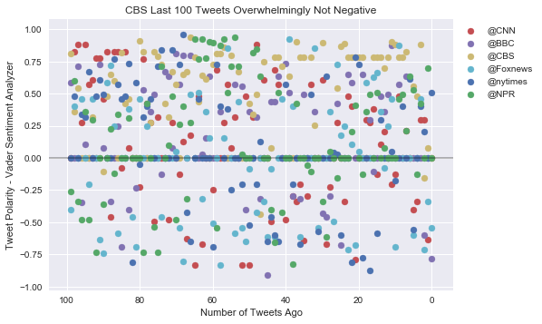
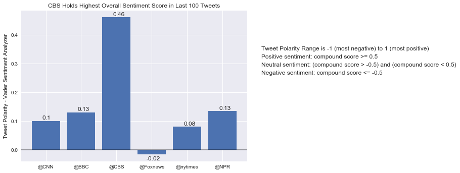
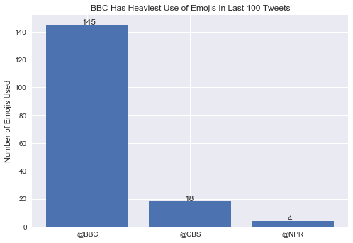

# News Mood
- Review of last 100 Tweets by top news outlets shows CBS tweets have considerably higher compound sentiment score than  BBC, Fox News, the New York Times and CNN. (Results obtained utilizing Vader Sentiment Analyzer).
- The average sentiment score for Fox News' last 100 tweets was close to neutral. Inspection of the individual tweet sentiment scores however shows that they vascilated between tweets that leaned more positively and more negatively, rather than each tweet itself rating neutrally. 
- Vader Sentiment Analyzer does not currently support emojis. Once supported, will BBC's high use of emojis in their tweets affect their sentiment score?


```python
import pandas as pd
from vaderSentiment.vaderSentiment import SentimentIntensityAnalyzer
import seaborn as sns
import matplotlib.pyplot as plt
import tweepy
import json
import numpy as np
from datetime import timezone
from datetime import datetime
import pytz
import emoji
```


```python
# list of news orgs to analyze
newsOutlets = ['@CNN','@BBC', '@CBS', '@Foxnews', '@nytimes', '@NPR']
```

### Don't forget to hide these!


```python
# Twitter API Keys
#kristine keys
consumer_key = "HqmbSQzqMOeQI5U6zaIS42Pja"
consumer_secret = "EfDRnSYxvdBXE4Tj5rwAZyNC5gJXOxg7GL32Vf6QNqb1K45Xaw"
access_token = "35740765-Z8VkREBVuYzEnoKwfKU9NqbJp1FRJEEUZ1VKQ5yNY"
access_token_secret = "N3VeKhoiOgFfrW65uFJflIfAxhDT24MHR2NVkFH5vd0XR"
```


```python
auth = tweepy.OAuthHandler(consumer_key, consumer_secret)
auth.set_access_token(access_token, access_token_secret)
api = tweepy.API(auth, parser=tweepy.parsers.JSONParser())
```


```python
analyzer = SentimentIntensityAnalyzer()
```


```python
# tweet date/times are reported in utc
local_tz = pytz.timezone('America/New_York')
```


```python
# create lists of lists to hold all data
sentiments = [[] for i in range(1, len(newsOutlets)+1)]
positives = [[] for i in range(1, len(newsOutlets)+1)]
negatives = [[] for i in range(1, len(newsOutlets)+1)]
neutrals = [[] for i in range(1, len(newsOutlets)+1)]
texts = [[] for i in range(1, len(newsOutlets)+1)]
localtimes = [[] for i in range(1, len(newsOutlets)+1)]
utctimes = [[] for i in range(1, len(newsOutlets)+1)]

# create a df to hold all 
df = pd.DataFrame(columns=['newsOutlet','text','utctime','localtime','compound','positive','negative','neutral'])

indexCounter = 0

for newsindex, news in enumerate(newsOutlets):
    if 1 == 1: #used for testing subsets; 1==1 will use all news outlets
        print("********************************************************************************************")
#         print(news)
        # loop through 5 times to get 100 tweets
        for page in range(1,6):
            print("**********************************************" + news + " Page " + str(page) + "**********************************************")
            news_tweets = api.user_timeline(news, page= page)

            # Loop through all tweets
            for index, tweet in enumerate(news_tweets):

                # Print the JSON object to view output
                # print(json.dumps(tweet, sort_keys=True, indent=4, separators=(',', ': ')))
                
                # print the tweet text
                print(str(index) + " " + tweet["text"])
                
                # add the text and time to lists
#                 texts[newsindex].append(tweet["text"])
                utcTime = tweet["created_at"]
#                 utctimes[newsindex].append(utcTime)
#                 utc_dt.replace(tzinfo=timezone.utc).astimezone(tz=None)
#                 localTime = utcTime.replace(tzinfo=timezone.utc)astimezone(tz=None))
#                 localTime = date(utcTime).strftime('%Y-%m-%d %H:%M:%S.%f %Z%z')
#                 times[newsindex].append(localTime)
                convertedTime = datetime.strptime(utcTime, '%a %b %d %H:%M:%S %z %Y')
                localTime = convertedTime.replace(tzinfo=timezone.utc).astimezone(local_tz)
                
                # analyze the tweet text
                compound = analyzer.polarity_scores(tweet["text"])["compound"]
                pos = analyzer.polarity_scores(tweet["text"])["pos"]
                neu = analyzer.polarity_scores(tweet["text"])["neu"]
                neg = analyzer.polarity_scores(tweet["text"])["neg"]
                
                
                # add the compound to the news sentiment list for plotting
                sentiments[newsindex].append(compound)
                
                # add all of the sentiments to their own lists
#                 positives[newsindex].append(pos)
#                 negatives[newsindex].append(neg)
#                 neutrals[newsindex].append(neu)
                
                # add all the data to the df
                df.loc[indexCounter] = [news,tweet["text"], utcTime, str(localTime), compound, pos, neg, neu]
                
                indexCounter += 1

```

    ********************************************************************************************
    **********************************************@CNN Page 1**********************************************
    0 One of cycling's biggest races will begin outside of Europe for the first time https://t.co/C3PpERlABk https://t.co/epkKiAfpJW
    1 Georgia Tech student fatally shot in the heart by campus police officer who ”overreacted,” lawyer says… https://t.co/CnLVBFSiIS
    2 Meghan McCain is in late-stage talks to join ABC's "The View," sources say https://t.co/mvQVTiGEaF
    3 Shares of Boeing are up more than 60% so far in 2017 https://t.co/xakDVaKa6d
    4 Sean Spicer's Emmy cameo wasn't funny at all, writes @CillizzaCNN https://t.co/4bxiMSNALo https://t.co/4LkJXHRrFT
    5 A federal judge hearing arguments about the termination of DACA is reading President Trump's tweets carefully… https://t.co/pnoUulquDl
    6 Snapchat has pulled Al Jazeera's channel from its app in Saudi Arabia https://t.co/5HMta0V0p2 https://t.co/a1jtKLrDdo
    7 CNN EXCLUSIVE: Iranian President says US will pay a high price if it scraps nuclear deal https://t.co/uX5ERdpx2S https://t.co/Zn7asUa7KX
    8 Donald Trump told Nikki Haley she could speak her mind. She's doing just that | STATE Magazine… https://t.co/TB0Kp0LgZa
    9 Trump's personal lawyer Michael Cohen is set to appear before the Senate intelligence committee on Tuesday… https://t.co/JZfQXANfGP
    10 Iran, North Korea expected to dominate Trump's first UN General Assembly https://t.co/G45zmFDoFf https://t.co/GMGcSZvij8
    11 Donald Trump's unpresidential presidency keeps hitting new lows I Analysis by Chris Cillizza https://t.co/AVYg2cAMR8 https://t.co/P7gGrO7wby
    12 Neil deGrasse Tyson says it might be 'too late' to recover from climate change https://t.co/FDtiJerfhU
    13 A top White House adviser affirms Trump is still planning to withdraw from the Paris climate accord… https://t.co/OFYbGeZ1lC
    14 Trump: In recent years, the UN has “not reached it’s full potential because of bureaucracy and mismanagement” #UNGA https://t.co/n3Hu3nCsIR
    15 Iran, North Korea expected to dominate Trump's first UN General Assembly https://t.co/UcmhTMzKox https://t.co/wlzq3kyg7z
    16 RT @CNNPolitics: President Trump at #UNGA: We must ensure no country has to “shoulder a disproportionate share of the burden” https://t.co/…
    17 India's push to go cashless has another high-profile supporter: Google. https://t.co/BjYMu1coQO https://t.co/gX7H1ZYzM4
    18 Hulu, the underdog of the streaming TV wars, just beat out Netflix and Amazon for TV's top prize https://t.co/8X2Ev1ivfQ
    19 RT @CNNnewsroom: NYT's @kenvogel on Trump's lawyers discussing Russia probe in public: "It's puzzling they would be so indiscreet" https://…
    **********************************************@CNN Page 2**********************************************
    0 The one issue Netanyahu wants to discuss with Trump today at the UN https://t.co/ZIQFDmTqws https://t.co/oaZo7W1urz
    1 Lady Gaga postpones the European leg of her tour due to 'severe physical pain' https://t.co/KjWdDLVrrl https://t.co/BLd34tWJX5
    2 Why did the #Emmys help Sean Spicer rebrand? via @brianstelter https://t.co/wllxKYjUQm https://t.co/MaPGYQ14wn
    3 Here's your complete list of #Emmys winners https://t.co/P0Wpx0coqs https://t.co/T2QuedpS6T
    4 Hurricane Maria is expected to get stronger in a hurry as it takes aim at the Caribbean islands devastated by Irma… https://t.co/N40MnFBDkV
    5 What are ‘sponge cities’? They may just be China’s answer to flooding in urban areas https://t.co/Ko8OcUeNl8 https://t.co/kiR4du2oGy
    6 RT @cnni: Here’s a rare look at Mount Paektu, a site sacred to North Koreans, as well as their neighbors to the south https://t.co/lOErZdUW…
    7 With the golf retweet, Trump blunders into the 'Streisand effect,' writes Kara Alaimo for @CNNopinion… https://t.co/x2F8UHLU7U
    8 In Bangladesh's overcrowded Rohingya refugee camps, supplies are limited and circumstances are dire… https://t.co/IkFe7EvsL0
    9 Both suspects in last week's London train attack were fostered by the same elderly couple, local officials say… https://t.co/M0wIyoRLsK
    10 Julia Louis-Dreyfus now holds the record for most #Emmys won by a single performer for one role… https://t.co/rijWZpXpA0
    11 Neil deGrasse Tyson says it might be 'too late' to recover from climate change https://t.co/t3PDSk2ncG
    12 White House lawyer overheard talking about colleagues &amp; Russia probe at DC steakhouse, according to NYTimes report… https://t.co/tlNwffzQls
    13 Alec Baldwin wins again at the #Emmys -- this time, for his portrayal of Trump on the most recent season of “SNL"… https://t.co/phc3WTybmZ
    14 Residents of the Lower Florida Keys have been returning home, more than a week after fleeing Hurricane Irma… https://t.co/O3CyyApJmf
    15 More than 80 arrested in third night of St. Louis protests https://t.co/kqcqKhKtQF https://t.co/htEbqFkowU
    16 Donald Trump's unpresidential presidency keeps hitting new lows I Analysis by Chris Cillizza https://t.co/LKhDPyitop https://t.co/WAgV0avWSd
    17 Hurricane Maria is expected to get stronger as it takes aim at the Caribbean islands devastated by Irma… https://t.co/hpUogf9OgU
    18 Residents of the Lower Florida Keys have been returning home, more than a week after fleeing Hurricane Irma… https://t.co/0pWMzyCt0g
    19 Why newsrooms must keep fact-checking Trump | Analysis by CNN's @brianstelter https://t.co/hBM7B5mqfa https://t.co/ucQFBA4xEz
    **********************************************@CNN Page 3**********************************************
    0 Woman arrested for vandalizing Wall Street's famed bull statue https://t.co/2lCRMYlVu3 https://t.co/c1kbPIZW6O
    1 From Reese Witherspoon to Sterling K. Brown, here are some of the award-worthy speeches at the #Emmys… https://t.co/fj3Bw4EfX8
    2 Alec Baldwin wins again at the #Emmys -- this time, for his portrayal of Trump on the most recent season of “SNL"… https://t.co/g6s8fB31ue
    3 Looking for a place where you can relax? These are the world's 10 least stressful cities, according to a new study… https://t.co/iLyqsc1Zc5
    4 How altruism and selflessness helped Florida Keys survive Irma's darkest days https://t.co/VNe3YtOvYz https://t.co/dCikeq4rpV
    5 Neil deGrasse Tyson says it might be 'too late' to recover from climate change https://t.co/2MDKnlXPIq
    6 Julia Louis-Dreyfus now holds the record for most #Emmys won by a single performer for one role… https://t.co/6mdfJY3qfL
    7 It takes 300 people, 12,000 parts and a year to make a single Steinway &amp; Sons piano. Here’s how the pianos are made… https://t.co/WyekfJ2zxZ
    8 “Master of None's" Lena Waithe becomes first black woman to win an #Emmy for outstanding writing for a comedy serie… https://t.co/rfnZjVNHdQ
    9 Hurricane Maria is forecast to rapidly strengthen over the next two days as it takes aim at Caribbean islands… https://t.co/BfmNhhJZFr
    10 Georgia Tech police fatally shoot student after knife confrontation https://t.co/2Dy3tvgRup
    11 Here's the complete list of winners at the 2017 #Emmys https://t.co/KH4qPqmF6X https://t.co/nGdFByXhTr
    12 More than 80 arrested in third night of St. Louis protests over acquittal of former police officer in fatal shootin… https://t.co/gqGg7Q1qXf
    13 This company is turning football helmet design on its head https://t.co/9hEUiHColA https://t.co/LJiODbGJit
    14 Hurricane Maria is forecast to rapidly strengthen over the next two days as it takes aim at Caribbean islands… https://t.co/Pt7InUSjmh
    15 Want a job as a NASA astronaut? Read this https://t.co/fVy7VH9zGd https://t.co/317OKtWr9M
    16 Alec Baldwin wins again at the #Emmys -- this time, for his portrayal of Trump on the most recent season of “SNL"… https://t.co/ktCrEptHkH
    17 Here’s a rare look at Mount Paektu, a site sacred to North Koreans, as well as their neighbors to the south… https://t.co/fo7DfA8WFD
    18 What are ‘sponge cities’? They may just be China’s answer to flooding in urban areas https://t.co/T8cVmCod0m https://t.co/MDjtKiMqx1
    19 Looking for a place where you can relax? These are the world's 10 least stressful cities, according to a new study… https://t.co/fUZerPBtFa
    **********************************************@CNN Page 4**********************************************
    0 Hillary Clinton rails on Facebook for its role in spreading Russian propaganda https://t.co/vWIelgcGxP https://t.co/UzxmzXIkOH
    1 We asked the stars at the #Emmys: What show are you binging right now? https://t.co/3TWD9DdsVI https://t.co/rAmHXLxDLl
    2 This company is turning football helmet design on its head https://t.co/sFrBH9vLPf https://t.co/4iRrbNOkDt
    3 7 arrested in connection with a fire at a school in Malaysia's capital that claimed the lives of 21 students… https://t.co/vshCTbKycs
    4 Here's the complete list of winners at the 2017 #Emmys https://t.co/Ku4R4pd3Qf https://t.co/hliio6Z65i
    5 Georgia Tech police fatally shoot student after knife confrontation https://t.co/kgXGtBapz6
    6 Hundreds of thousands of Rohingya fled to Bangladesh to escape bloodshed in Myanmar. These are some of their storie… https://t.co/zmdteSPOee
    7 London commuters begin week with heavy security on transport routes after the #ParsonsGreen terror attack last week https://t.co/SYljWbVg3a
    8 Opponents of Australian same-sex marriage launched their "no" campaign, taking their message to skies over Sydney… https://t.co/SGaOuIuuqi
    9 Iran and North Korea are expected to dominate US President Trump's first UN General Assembly https://t.co/MCWQridCoj https://t.co/7C9sKYU7t1
    10 It takes 300 people, 12,000 parts and a year to make a single Steinway &amp; Sons piano. Here’s how the pianos are made… https://t.co/drstsryRUg
    11 Former White House press secretary Sean Spicer made a surprise cameo at the #Emmys https://t.co/xDylbGKbXX https://t.co/L7ntkZiYKq
    12 Woman arrested for vandalizing Wall Street's famed bull statue https://t.co/kdk4BaZJ4l https://t.co/G5bPIF3Mmu
    13 Neil deGrasse Tyson says it might be 'too late' to recover from climate change https://t.co/V54XSiRh3S
    14 From Reese Witherspoon to Sterling K. Brown, here are some of the award-worthy speeches at the #Emmys… https://t.co/D4Ugck75tb
    15 Hurricane Maria is forecast to rapidly strengthen over the next two days as it takes aim at Caribbean islands… https://t.co/pWPykAm0w4
    16 Here's a look at a US-unit in South Korea designed to limit the damage to Seoul from North Korea in the event of wa… https://t.co/tmlz7mUJm8
    17 Here’s a rare look at Mount Paektu, a site sacred to North Koreans, as well as their neighbors to the south… https://t.co/XtKfAaGbeZ
    18 When China's biggest companies host annual parties, some top executives like to steal the show… https://t.co/DjGV6qpqsN
    19 Big wins for “Veep” and “The Handmaid’s Tale” at an #Emmys that cast US President Trump in a supporting role… https://t.co/27Cgq4PCHQ
    **********************************************@CNN Page 5**********************************************
    0 In Bangladesh's overcrowded Rohingya refugee camps, supplies are limited and circumstances are dire… https://t.co/sY915c8NOb
    1 Here's a side of North Korea the world rarely sees https://t.co/vg7x7X0acp https://t.co/uZOrf9Jjys
    2 With the golf retweet, Trump blunders into the 'Streisand effect,' writes Kara Alaimo for @CNNopinion… https://t.co/wbfHs3LabN
    3 Want a job as a NASA astronaut? Read this https://t.co/Vm3ZGxZ2h1 https://t.co/zMOsnppIfs
    4 RT @CNNent: .@HandmaidsOnHulu wins Outstanding Drama Series. #Emmys
    https://t.co/kW0bACaYEQ https://t.co/u7RaAqkiQK
    5 Republican leaders are serious about one last attempt to overhaul Obamacare https://t.co/SvMsLvLsR7 https://t.co/5uVihhWtwd
    6 RT @CNNent: Elisabeth Moss wins Outstanding Lead Actress in a Drama Series for @HandmaidsOnHulu #Emmys
    https://t.co/JpDysgJ8Uu https://t.co…
    7 RT @CNNent: .@SterlingKBrown wins Outstanding Lead Actor in a Drama Series for @NBCThisisUs #Emmys
    https://t.co/jwFxSD2AcQ https://t.co/LtW…
    8 Four American college students attacked with acid on Sunday at a train station in Marseilles, France, police say… https://t.co/UULJw6kqVF
    9 RT @CNNent: .@blackmirror: San Junipero wins Outstanding Television Movie. @netflix #Emmys
    https://t.co/brn70N0OyM https://t.co/bT9jP9cvaC
    10 Baton Rouge shootings may be racially motivated, police say https://t.co/5ZWcyRAm82 https://t.co/Dq9Uh7rOrd
    11 RT @CNNent: Nicole Kidman wins Outstanding Lead Actress in a Limited Series or TV Movie for #BigLittleLies #Emmys
    https://t.co/l3ccLYndxL h…
    12 RT @CNNent: .@rizmc wins Outstanding Lead Actor in a Limited Series or TV Movie for #TheNightOf #Emmys
    https://t.co/YK1ALQbNru https://t.co…
    13 Julia Louis-Dreyfus now holds the record for most #Emmys won by a single performer for one role… https://t.co/gV7NfTm0rT
    14 In Ho Chi Minh City, a street known to musicians as "Guitar Street" -- offers beautifully made acoustic guitars… https://t.co/ifGuXC2U76
    15 “Master of None's" Lena Waithe becomes first black woman to win an #Emmy for outstanding writing for a comedy serie… https://t.co/rkkRuRuNIN
    16 Here’s a rare look at Mount Paektu, a site sacred to North Koreans, as well as their neighbors to the south… https://t.co/smRVTDlP3a
    17 RT @CNNent: .@LenaWaithe is the first black woman to win outstanding writing for a comedy series. https://t.co/riGgr8n63N #Emmys @Televisio…
    18 RT @CNNent: Reed Morano wins Outstanding Directing for a Drama Series for @HandmaidsOnHulu #Emmys
    https://t.co/wTZoMrXnMv https://t.co/vV68…
    19 What are ‘sponge cities’? They may just be China’s answer to flooding in urban areas https://t.co/oOuBWDPuWO https://t.co/WzpiUv3fGE
    ********************************************************************************************
    **********************************************@BBC Page 1**********************************************
    0 Angry swan, 'arrested' by police following 'road rage' incident. 😂 https://t.co/fQBCOhiq8F https://t.co/RJQ4k6JJos
    1 Andy Murray: 'Tennis women make the same sacrifices as men.' 🎾 https://t.co/V0ja8rwr5R https://t.co/NAWSC5NDJV
    2 🦍 Cincinnati Zoo has introduced its first new gorilla since the death of Harambe in 2016. https://t.co/nUfeUHoBEf https://t.co/eTqyz63gXI
    3 RT @bbcwritersroom: Screenwriter Stephen Butchard on adapting Ian McEwan's The Child in Time for @BBCOne starring #BenedictCumberbatch http…
    4 RT @BBCSpringwatch: Why have so many Portuguese man-of-war washed up on Cornwall's beaches? Read more from @BBCCornwall 👉🏽 https://t.co/pJY…
    5 When you've worked in customer service WAY too long… 😂 Via @BBCTheSocial. https://t.co/0rbOynj0fz
    6 Cast an eye over the best-dressed stars at this year's #Emmys in LA. 👀 https://t.co/4CdOzdUzPg https://t.co/DawdnozKzb
    7 RT @BBCR1: "The fans are so cool." 
    
    @MileyCyrus chats to @ClaraAmfo about her love for the UK 💛✨
    
    Watch the full interview 👉 https://t.co/…
    8 RT @bbccomedy: New #W1A tonight, 10pm @BBCTwo! In the mean time, writer and director John Morton blogs about the new series 👉 https://t.co/…
    9 RT @bbcmusic: 🎉 Celebrate 25 years of @BBCLater on @BBCiPlayer
    We delve into the shows archives to bring you the A-Z of Later
    👉https://t.co…
    10 RT @CBeebiesHQ: John Humphrys as you've never seen him before! 😳
    
    Can he keep @GoJetters' Ubercorn in check? 🦄
    
    🙌 🚀 🌎
    
    @MastermindQuiz
    
    @BB…
    11 🥁🎸 Handwritten notes &amp; heartfelt posts. Here are 7 heartwarming letters sent from fans to their music heroes. 👉… https://t.co/p0W59Am5bb
    12 RT @BBCR1: That VOICE 😍
    
    So good to have @RitaOra perform Your Song in the Live Lounge 💫
    
    Listen here 👉 https://t.co/48RuyAdouO https://t.c…
    13 RT @BBCR1: WOAH 💖
    
    @RitaOra pays homage to musical icon @Madonna with her take on Like A Virgin ✨
    
    #R1LiveLoungeMonth https://t.co/ET7vltwn…
    14 🎬 A quick rundown of the #Emmys nominees &amp; winners in the major categories. 👉 https://t.co/5qjL9OuCao https://t.co/oL0jeA126H
    15 Two new murals by Banksy have appeared in central London. 🎨 https://t.co/EWfzMYls4d https://t.co/s9w8sJRdON
    16 RT @bbcthree: This riddle will reveal if you have a gender bias. https://t.co/4EniYl2xJM
    17 What a way to pop the question! A man in Devon surprised his girlfriend by ploughing his proposal into a field. 💕🚜🌳… https://t.co/CQlHapCiVu
    18 RT @BBC_Teach: Did you know Sun 24 September marks 60 years of BBC Schools? Which programmes do you remember from school? Let us know using…
    19 'I have kleptomania but when it gets bad I take something for it.' 😂
    Are these the best comedy one-liners ever told… https://t.co/ZBoDvI3v4S
    **********************************************@BBC Page 2**********************************************
    0 RT @bbccomedy: It's 26 years this week since Bottom first aired! Saluting @AdrianEdmondson and the much-missed Rik Mayall ❤️ GAS MAN! GAS M…
    1 19-year-old Swiss skier @AndriRagettli shows off his parkour skills during a training session. Via @BBCNewsbeat. ⛷ https://t.co/qcBpeWDVCZ
    2 RT @BBCR1: Who's ready for @RitaOra in the Live Lounge? ✨
    
    Make sure you're listening at 12pm 👉 https://t.co/48RuyzVNDg
    
    #R1LiveLoungeMonth…
    3 RT @AboutTheBBC: "Nothing worthwhile is easy" - John Morton, writer and director of #W1A and #TwentyTwelve blogs about the new series https…
    4 RT @bbcpress: 🎬 First look at David Tennant and @MichaelSheen in @BBCTwo's #GoodOmens as filming begins: https://t.co/DnJWYqJaZf https://t.…
    5 'It's been a hell of a journey to get to this point.'
    #BattleToTheStartLine, now on @BBCiPlayer.… https://t.co/ELGufLIUHv
    6 How Hull became Britain's hotbed of ballet talent. 🙆🎵 https://t.co/RT1Z6o4EP9 https://t.co/yvSllDdXw9
    7 Where does the world of Gilbert &amp; George end, and where does the real world begin? https://t.co/X3eiTBwyjf https://t.co/XTJc17yO6Y
    8 RT @BBCNewsbeat: Donald Glover (aka Childish Gambino) made history at the #Emmys last night. https://t.co/eYH5DrxARb https://t.co/SR9AeC2Rho
    9 🌱 The mystery of the lost Roman herb. It used to be worth its weight in gold – but no one knows if it still exists.… https://t.co/DXdwXUTwMo
    10 RT @BBCRadio3: 🐝 🌳 🎶 For those of you that love the idea of music and nature but don't have a great deal of time to spare.
    https://t.co/Hkz…
    11 RT @BBCEngland: Two murals by street artist Banksy have appeared in central London https://t.co/8gWBZYCQef https://t.co/6jwoTKMqUz
    12 RT @bbcdoctorwho: Ready to embark on another week?
    #MondayMotivation #DoctorWho https://t.co/iE33olwL7X
    13 RT @BBCLondonNews: Two murals by street artist Banksy have appeared in central London https://t.co/6Eo3zHNPLE https://t.co/u10j1TLANn
    14 RT @bbcthesocial: Have ye ever been to HoolieKrankie?
    
    (via @BBCScotland)
    https://t.co/qgWJsf8mb7
    15 RT @BBCOne: 🎉🎉Good news!🎉🎉
    We're pleased to announce #Strike will return to @BBCOne​ next year with #CareerOfEvil. 🙌 https://t.co/xLSICWAmz2
    16 Every year, more than 1,000 lives are lost on Peru's mountain roads. 🏔🚍 Via @BBCEarth. https://t.co/HM2MmKWvvl
    17 Plants perceive the world without eyes, ears or brains. Understanding how can teach us a lot about them. 🌼🌿… https://t.co/CimLDQhmWQ
    18 Love, loss and every parent's worst nightmare. 💔 #TheChildInTime, starring Benedict Cumberbatch, coming soon to… https://t.co/dBZbxUdxFj
    19 ❤️️ Meet the inspirational #InvictusGames competitors on #BattleToTheStartLine. 7:35pm @BBCOne. @KensingtonRoyal.… https://t.co/TENNVywu1d
    **********************************************@BBC Page 3**********************************************
    0 🍲⏰ Super speedy suppers that won't disappoint on the flavour front. 👉 https://t.co/VCM39TWthv https://t.co/iGibqbYePL
    1 In the Yukon’s remote mountains is evidence of the Earth’s tumultuous climate swings from millions of years ago. 🏔… https://t.co/KJWFZrjiEx
    2 'The happiest years I've ever spent were those working in the Women's Land Army.' 💪👭 Via @BBC5Live. https://t.co/6YJLgCdczy
    3 Why are we willing to pay for bottled water when we can get it out of the tap for free? 🚰 https://t.co/kgqFsC9BJO https://t.co/hXnSTDC60K
    4 💍 Tying the knot changes our personalities for better &amp; for worse... https://t.co/Zd91A4jxhC https://t.co/kKSc19PNSZ
    5 The woman highlighting New Zealand's devastating suicide problem with hundreds of pairs of shoes. ❤️️👟 Via… https://t.co/RKCwFQO3gM
    6 🌳🥇 An oak with royal connections &amp; a mulberry at the centre of a legend are up for the title of Tree of the Year.… https://t.co/HTMtgU0j0G
    7 Jim Carrey calls NY Fashion Week 'meaningless' in bizarre interview. 
    https://t.co/pGJqjNwiUY https://t.co/OQcuHgAWS0
    8 Introducing Samantha, a robot with a human-like brain and the ability to 'feel emotion'. 🤖 💕 https://t.co/VuEwDBgDGh https://t.co/DwlKyINmZf
    9 🔥🏌Because nothing stands in the way of the 18th hole. https://t.co/2LI00ZAKpg https://t.co/B4wDXMmoaL
    10 Do animals smile? 🐵😃 Via @BBCNewsbeat. https://t.co/aPCjhLYU8v
    11 The problem for the world’s most expensive spice. 🔥 https://t.co/ee9i4REECD https://t.co/uPq1l8fKFj
    12 Gifs seem brightly millennial – so it might come as a surprise that the they actually turned 30 this year. 🎈… https://t.co/dJtgbyPOxl
    13 📝 Seven of your biggest grammar bugbears sorted. 👉 https://t.co/L1jyOMTvCO https://t.co/mVM1klwQRQ
    14 RT @BBCArchive: #OTD 1948: Hard-as-nails men, in skirts, throwing tree trunks? It can only be the Braemar Games, which celebrated its Royal…
    15 RT @BBCMOTD: What a weekend of #PremierLeague action we've had so far! 🙌 
    
    Watch #MOTD2 Extra @BBCTwo &amp; @5liveSport 12:15 BST. https://t.co…
    16 RT @bbcgetinspired: Coach💪
    Kit collector💪
    Volunteer💪
    
    Let @campbelldarren tell you all about nominating your #BBCUnsungHero https://t.co/yj…
    17 🌩💦 Why do storms have names and who gets to decide them? https://t.co/SiGfkdl3We https://t.co/1FYOfYvfs5
    18 What reefs should look like. 🦈🐠🦐 
    #TribesPredatorsAndMe via @BBCEarth &amp; @BBCTwo. https://t.co/cMiuqniCef
    19 Cheeselog? Chisel Bob? Chuggy pig? What do you call woodlice? This map reveals how the answer differs across the UK… https://t.co/qq0upjaG1k
    **********************************************@BBC Page 4**********************************************
    0 🙏🐶 From downtrodden dog to downward facing dog. ❤️️ Via @BBCTheSocial. https://t.co/OLr9AeT4s2
    1 An apple a day... 🍎 Here are five of Mary Berry's best apple bake recipes. 🍏 https://t.co/7KCkk9wDnT https://t.co/WhLt7LiRHB
    2 RT @bbcworldservice: Why has a film about a century-old romance between a dancer and a future Tsar provoked protests? 📻
    https://t.co/g8LVMH…
    3 RT @CBeebiesHQ: Grandpa in My Pocket's Susan Jameson reads Norman the Slug with the Silly Shell by @suehendra🐚
    
    Tonight's #BedtimeStory at…
    4 RT @BBCRadio2: Ray Davies basks in that Waterloo Sunset at Last Night At The Proms 🌇 https://t.co/orJ650oa29 https://t.co/jHCXQDCQU4
    5 A dark new Swedish drama comes to @BBCFour. #BlackLake starts tonight at 9pm. ❄️ https://t.co/nro3ZHLQfs https://t.co/2wZiGx2SnS
    6 🎶🎤 Some of the world's greatest tribute acts go head to head in Even Better Than The Real Thing. 7pm on @BBCOne.… https://t.co/LBLtvHoBTM
    7 It hasn't just been humans seeking shelter from Hurricane Irma. ❤️️ Via @BBCNewsbeat. 🐶🐱🐦 https://t.co/3Mgy8j1HwX
    8 Tonight, five of the world's greatest tribute acts go head to head. Even Better Than The Real Thing. @BBCOne at 7pm… https://t.co/qDq5hX6Sj9
    9 🎤🎵 Are you a budding choir member or just wanting to improve your shower tunes? Try these top tips on singing. 👉… https://t.co/XanLPCZYBN
    10 🦈 Care for a dip? 'Fluffy' the baby great white who washed up on a Sydney beach has been given temporary residence… https://t.co/DbmhMoedIQ
    11 🤢 A huge 'fatberg' has been found blocking a London sewer. The solid mass of fat is one of the biggest ever seen.… https://t.co/CVp3RKb1qu
    12 Hold on... Whitney Houston's 'I Will Always Love You' is a cover? 😲 🎶 Here are 12 other hits that aren't originals.… https://t.co/NXzSjZqmom
    13 Psst...The secret is to cook them twice! Here's how to make the best chips you've ever tasted. 🥔 👉 🍟… https://t.co/zQ5i8y9UB4
    14 Think you can't teach an old dog new tricks? Think again. Studies show it's never too late to learn. 👵💡… https://t.co/aTQTOXjrOk
    15 💖😢 We were blown away by @Pink's #R1LiveLoungeMonth performance. If you haven't seen it yet, do yourself a favour.… https://t.co/Johq9jxtfE
    16 'They care more about their families than themselves.' #BattleToTheStartLine Sunday 7.35pm @BBCOne.… https://t.co/afZtyAnzaT
    17 RT @bbcgetinspired: Got moves? Take them to the next level. 
    
    Here's how to keep fit through dancing https://t.co/oSbmWGOARu #GetInspired h…
    18 RT @CBeebiesHQ: Monday sees Postman Pat return to full-time working hours!
    
    Take a look at the secrets inside the set 😲
    🚢🚁🚘🚀🚗
    
    👉👉 https://t…
    19 RT @bbcthree: Joshua couldn’t walk or talk but now he’s defying doctors’ expectations as a dancer, comedian and father. https://t.co/0wEwyz…
    **********************************************@BBC Page 5**********************************************
    0 These expanding clothes could grow with your kid or baby bump - or even your tummy after a big meal.🤰👶 Via @BBCTech. https://t.co/Ff55vbdzx5
    1 Ever jirbled? Forgotten a bumbershoot? Wasted time on a boondoggle? Here are 12 wonderful words we should all use.… https://t.co/wr0KSjl0uB
    2 💰🌳 The legend of the money tree with magical healing powers. #GrandToursofScotlandsLochs via @BBCScotland. https://t.co/RY17CJdbY8
    3 Are you more Sonic the Hedgehog or Crash Bandicoot? Take this quiz to find out which video game character you are.… https://t.co/yvZdOCUdAv
    4 ⚽️ 🥅 These photos of urban goalposts from across the UK tell moving story. https://t.co/YeaGRUtOgZ https://t.co/tPhr9O6B6V
    5 More action needed to tackle 'hedge rage' &amp; disputes between neighbours. 🌳😡 https://t.co/nGVu3s9eP4 https://t.co/GTKs3ozFmD
    6 How did we get here? Here is a timeline of the chance events that led to human existence. 🌎 https://t.co/Lf0MQTIuB0 https://t.co/yFIpgTIiou
    7 🦋 That one person who gives you butterflies every single time. 😂 Via @BBCTheSocial. https://t.co/msrgRR1U3e
    8 Take a peek inside London's lost property treasure trove to see the bizarre items left behind on public transport.… https://t.co/ZMfA74Z9u1
    9 Archaeologists have found artefacts that could qualify as early robots from as far back as 2000 years ago. 🤖… https://t.co/mBlgmidMlF
    10 Diving face first into the weekend like...
    
    #FridayFeeling https://t.co/7Kt1K0GF6y
    11 The first oysters fresh off the boat are irresistible, but the rest of September’s harvest can be saved for winter.… https://t.co/0UIei7hJP3
    12 RT @BBCScotlandNews: Days are getting shorter, but Scotland's still looking braw. Your pics in this week's gallery: https://t.co/odJO9Wl9mu…
    13 RT @BBCNewsround: POW! Check out what happened when Ju-to-the-di met Lethal Bizzle 😎 https://t.co/E0T1Fv51Ga https://t.co/rc067ZRVNM
    14 Byssus, or sea silk, is one of the most coveted materials in the world – but is this ancient thread unravelling?… https://t.co/2RuilsBb7o
    15 🤸@NadiaComaneci10 &amp; @Simone_Biles who changed gymnastics 40 years apart, share the highs &amp; lows of competing. More… https://t.co/GyRNpLe7j8
    16 RT @BBCR1: 🎶 Oh she's just being Miley 🎶
    
    OBSESSED with @MileyCyrus' country version of See You Again 😍
    
    #R1LiveLoungeMonth https://t.co/zf…
    17 A team of scientists &amp; @NASA astronauts have joined forces to help save the world's coral reefs. 🐠🦈… https://t.co/wdtHYZ7MGj
    18 RT @BBCTwo: Some of these remote tribes have never seen a polar bear before. Their reaction is priceless... 😍 #Tribes https://t.co/72xRccts…
    19 RT @bbcworldservice: As #Cassini dives into Saturn, salute the amazing imagery it has sent back in its 20 year-mission. 🎥  🚀 https://t.co/U…
    ********************************************************************************************
    **********************************************@CBS Page 1**********************************************
    0 See the biggest names in television light up the #Emmys red carpet: https://t.co/5yaM4UF4KX #ICYMI https://t.co/4qh6onq8OF
    1 Host Stephen Colbert blew the audience away with his opening number at the #Emmys. Watch the full clip:… https://t.co/Rv3NwjJuKZ
    2 Did you miss television's biggest night? Catch up on the #Emmys now: https://t.co/EMxWKauzMb https://t.co/2Y71gw7Jr7
    3 Catch up on all the entertaining speeches and big wins from the most glamorous night on TV. Watch the #Emmys now:… https://t.co/FRoKq9OFTs
    4 Who took home a golden statuette? See the complete list of winners from the #Emmys: https://t.co/W9VduVc9lp https://t.co/d5FqBXDhtn
    5 A complete showcase of Stephen Colbert's funniest moments from the #Emmys: https://t.co/L1vnRQw4Ri https://t.co/f9RHVgC2Kc
    6 RT @colbertlateshow: Stephen starts to glitch while hosting the #Emmys &amp; needs to be evaluated... in the nude. Watch the full diagnosis: ht…
    7 That’s a wrap! Congratulations to all #Emmy winners! https://t.co/Pi8ASpHYK5
    8 RT @TheEmmys: Congrats #ElizabethMoss on your Primetime #Emmy  Award for #TheHandmaidsTale https://t.co/T13uVadatj
    9 RT @TheEmmys: Congrats @SterlingKBrown on your Primetime #Emmy Award for #ThisIsUs https://t.co/wv5Y3rBOkG
    10 RT @TheEmmys: Congrats #BiglittleLies on your Primetime #Emmy  Award for Best Limited Series #womenasheroes https://t.co/198e4IJYnt
    11 RT @TheEmmys: Congrats @blackmirror on your Primetime #Emmy  Award for Best Television Movie #LoveWillWin https://t.co/Hyxtws5v8O
    12 RT @TheEmmys: Congrats #nicolekidman on your Primetime #Emmy  Award for #BigLittleLies https://t.co/VTfs8OSoC8
    13 S.W.A.T. star @ShemarMoore lights up the red carpet with a smile. See all the glamorous #Emmys looks:… https://t.co/MPPQk2QVOn
    14 RT @TheEmmys: Congrats @rizmc on your Primetime #Emmy  Award for #TheNightof https://t.co/OUYAASicfe
    15 RT @TheEmmys: Congrats @VeepHBO on your Primetime #Emmy  Award https://t.co/XL6IuF8HlF
    16 RT @TheEmmys: Congrats @OfficialJLD on your Primetime #Emmy  Award for #Veep @VeepHBO https://t.co/HigOeXXyzz
    17 Classic CBS stars, Norman Lear and Carol Burnett made an appearance tonight at the #Emmys! https://t.co/lkQp6uKMyg
    18 CBS star @AllisonBJanney looks ravishing in white at the #Emmys. See all the best-dressed stars on the red carpet:… https://t.co/BFzxtrrjhx
    19 RT @TheEmmys: Congrats @donaldglover on your Primetime #Emmy  Award for @AtlantaFX #Atlanta https://t.co/LAYFF77Rvb
    **********************************************@CBS Page 2**********************************************
    0 RT @TheEmmys: Congrats @iamjohnoliver on your Primetime #Emmy  Award for #LastWeekTonight https://t.co/HeusvOdGHW
    1 RT @TheEmmys: Congrats #DonRoyKing on your Primetime #Emmy  Award for #Saturdaynightlive https://t.co/O73irJuSq3
    2 RT @TheEmmys: Congrats @CharlieBrooker on your Primetime #Emmy Award for #BlackMirror https://t.co/iViGEfr0ya
    3 RT @TheEmmys: Congrats @reedmorano on your Primetime #Emmy  Award for #TheHandmaidsTale #FemaleDirectors https://t.co/yvacXuYnA3
    4 From dreams to reality. Congratulations @LenaWaithe and @azizansari on your Primetime #Emmy Award! https://t.co/TaSQsiIhRs
    5 If you liked @markfeuerstein at the #Emmys, you'll love him in the new comedy coming this fall, @9JKLCBS! https://t.co/7Kt9tE57DJ
    6 Sheldon x 2 = Adorable! #Emmys @IainLoveTheatre https://t.co/loABr28IgD
    7 Sean Spicer appears to confirm largest #Emmys audience ever, period. Watch the star's reactions:… https://t.co/l0x4NiCJsO
    8 Come on, it's @Oprah! https://t.co/vgTlY6qzGE
    9 CBS' own @SonequaMG and @jeremypiven are quite a duo as presenters at the #Emmys! https://t.co/ufxH7380cS
    10 RT @TheEmmys: Congrats #AlexanderSkarsgard on your Primetime #Emmy Award for #BigLittleLies "thank u for making me feel like one of the gir…
    11 RT @SuperiorDonuts: Does the voice of the #Emmys sound familiar? Watch them live now on @CBS &amp; CBS All Access: https://t.co/4LDe6vCybL #Sup…
    12 Don't miss all of the sketches and dresses and speeches and more! Watch the #Emmys LIVE on CBS and CBS All Access!… https://t.co/0RgtVcsoIT
    13 RT @TheEmmys: Congrats #jeanmarcvallee on your Primetime #Emmy  Award for #BigLittleLies https://t.co/O9b32ehkal
    14 RT @colbertlateshow: Are you watching what @SeanSpicer confirmed is the largest #Emmys ever, period? What are you waiting for? https://t.co…
    15 RT @TheEmmys: Congrats @AlecBaldwin on your Primetime #Emmy  Award for #Saturdaynightlive https://t.co/VurSzGMjA5
    16 RT @TheEmmys: Congrats #brucemiller on your Primetime #Emmy Award for #HandmaidsTale https://t.co/xmosDAyQ2V
    17 RT @TheEmmys: Congrats @nbcsnl on your Primetime #Emmy Award for Best #VarietySketch Series https://t.co/DYhkh2NxNN
    18 When the #Emmys asks you to take your clothes off on TV. https://t.co/O26aHapn1d
    19 Congratulations, Donald Glover! #Emmys https://t.co/uFV9A9xo6g
    **********************************************@CBS Page 3**********************************************
    0 The #Emmys where we finish each other's....sentences! https://t.co/sOAlMCu3A9
    1 RT @TheEmmys: Congrats #Lauradern 4 Primetime #Emmy #BigLittleLies "I've been acting since I was 11 yrs old and I've worked with, like 12 w…
    2 RT @TheEmmys: Congrats #katemckinnon on your Primetime #Emmy  Award for #snl https://t.co/kXXQvODuRl
    3 RT @TheEmmys: Congrats @JohnLithgow on your Primetime #Emmy Award for #TheCrown https://t.co/CZoAEz8aBg
    4 RT @colbertlateshow: Here's the moment @StephenAtHome walked offstage after that epic opening number and monologue at the #Emmys. https://t…
    5 Spotted: @shemarmoore from @swatcbs looking sharp! #Emmys https://t.co/vIOp7IAswH
    6 This is how you do a happy dance #Emmys! Who are you excited to see tonight? https://t.co/T1P2OmBY9e
    7 Everyone's losing their marbles at the #Emmys ! https://t.co/v6zMytSfAV
    8 Everything is better on TV! #Emmys
    9 Don’t miss the 69th Emmy® Awards – streaming LIVE now on CBS &amp; CBS All Access: https://t.co/whuCPMC3Er #Emmys https://t.co/o2cy3lFA84
    10 Thank you cam, hosted interviews, photo lounge &amp; more! See the #Emmys action behind-the-scenes with Backstage Live:… https://t.co/mzxgPGcwh4
    11 RT @colbertlateshow: Sneak peek at where @StephenAtHome will spend much of his time hosting tonight's #Emmys. What do you think of this inc…
    12 The stars have arrived! ⭐️ Watch the #Emmys red carpet LIVE on Facebook with @etnow's @leanneaguilera here:… https://t.co/3JGXokwGik
    13 Television’s greatest night has arrived! Watch the #Emmys tonight at 8 PM ET / 5 PM PT on CBS and CBS All Access:… https://t.co/0fKy11rhoF
    14 Stream the #Emmys red carpet LIVE today with @etnow's @leanneaguilera on the CBS Facebook page. Details:… https://t.co/DmBLxofpIE
    15 Get ready for football! Stream NFL on CBS today w/ #CBSAllAccess. Try 1 week FREE! (Not available on mobile phones)… https://t.co/vag5N9BfvH
    16 Tonight's the night! Here's everything you need to know about the #Emmys: https://t.co/LYH1GYoK1i https://t.co/XMrAXwkZ10
    17 RT @colbertlateshow: The most important part of any #Emmys rehearsal... practicing how to make @Oprah your best friend. (Yep. I'm coming fo…
    18 The stars come out tomorrow! ⭐ Stream the Emmy® Awards LIVE on CBS All Access. Start your FREE trial now:… https://t.co/NfmUwcs3gV
    19 Relive all the spectacular performances in honor of country’s icons. All the greatest moments from the #ACMHonors:… https://t.co/tvmtXaksE0
    **********************************************@CBS Page 4**********************************************
    0 Find out how the 69th Emmy® Awards' hopefuls go from nominees to winners: https://t.co/bSm06K2EkQ #Emmys https://t.co/5UdTJWXbs3
    1 Stream the #Emmys red carpet tomorrow LIVE with @etnow's @leanneaguilera on the CBS Facebook page. Details:… https://t.co/tghgzhFVVB
    2 Stream #23 Tennessee @ #24 Florida LIVE today at 3:30PM ET with a FREE trial of #CBSAllAccess:… https://t.co/PQfcWMC2bo
    3 And the winner is... Don't miss the #Emmys, hosted by Stephen Colbert, live tomorrow on CBS and CBS All Access:… https://t.co/p2mvqn0Zdh
    4 Catch up on all the stunning performances and memorable speeches at the #ACMHonors! Watch the full special:… https://t.co/CBaNmI5VL6
    5 Find out who performed special tributes to country's biggest stars. All the greatest moments from the #ACMHonors:… https://t.co/jjmYOQGZF0
    6 RT @avacbell: WOW! @GeorgeStrait still sounds so amazing live!! A true American country legend! #ACMHonors #countrymusic #Nashville
    7 What a night! Congratulations to all of the #ACMHonors recipients! https://t.co/f6cucRx4DD
    8 RT @danaraenc: Chris Stapleton singing a George Strait song… Yes please! #ACMHonors ❤️🎼🎤
    9 Here comes the ACM Vocal Group of the Year, @LittleBigTown! #ACMHonors https://t.co/BxZFi8svMA
    10 RT @GingerSnaps: This Glen Campbell tribute on the #ACMHonors is perfection. #chills
    11 RT @Purpletenn: Love seeing the artists in the audience, singing along to the artists on stage! ❤️ #ACMHonors
    12 ACM Male Vocalist of the Year, @ThomasRhett sure knows how to captivate a crowd. #ACMHonors https://t.co/PNvSEe39Vz
    13 RT @DollyParton: It's all true 😉
    
    #ACMHonors https://t.co/4IPN93ldDl
    14 The Queen of Nashville, @dollyparton, has given the world so much more than music. Thank you for your generosity, D… https://t.co/FRuxzPVwC0
    15 The legend, @BradPaisley honoring @dollyparton! So much talent packed onto the stage tonight! #ACMHonors https://t.co/mF7LQZu2FU
    16 Congratulations @KelseaBallerini for receiving the Gene Weed Milestone Award! #ACMHonors https://t.co/D3rBxteQFa
    17 RT @Momof3princess: My kids are laughing at me but I am singing right along #ACMHonors https://t.co/kSAoPXEqZQ
    18 Toby Keith is bringing us back to 1993 with his debut single, “Should’ve Been a Cowboy!” #ACMHonors https://t.co/64kLnJQZoq
    19 Congratulations, @Reba for receiving the Mae Boren Axton Service Award! #ACMHonors https://t.co/sI6bGXziAb
    **********************************************@CBS Page 5**********************************************
    0 RT @GOPatterson: YES @HillaryScottLA AND @KarenFairchild HONORING @reba 🙌🏽❤️🙌🏽 #ACMHonors This is Heaven !!
    1 .@HillaryScottLA, @KarenFairchild and @ohgussie are serenading @Reba with her own hits! 🎶
    #ACMHonors https://t.co/5OA0lspNn0
    2 RT @RussellMadison_: Time for #ACMHonors !
    3 Don’t miss out on an evening with country music’s biggest stars, the 11th Annual ACM Honors begins soon! #ACMHonors https://t.co/LECt13Hloa
    4 Tonight, get ready for a country celebration! Watch the #ACMHonors @ 9/8c on CBS, or stream it with CBS All Access:… https://t.co/U76gWo1mEG
    5 RT @CBSBigBrother: Paul, Christmas, &amp; Josh begin the battle to win the $500,000 grand prize tonight at 8/7c on #BB19: https://t.co/uudtMeMR…
    6 RT @TheTalkCBS: Even our ladies know that as hosts, sometimes you have to bare it all - just ask #Emmys host @StephenAtHome https://t.co/3Y…
    7 RT @SEALTeamCBS: See how #SEALTeam's heroic German Shepherd—DITA the Hair Missile—spends her days on set! 🐕📷: https://t.co/hoqjTFrtbC https…
    8 The #Emmys are streaming LIVE on CBS All Access this Sun, Sept. 17 at 8pm ET/5pm PT! Start your FREE trial now:… https://t.co/Y2mkqLZPkb
    9 RT @startrekcbs: Welcome aboard the bridge of the U.S.S. Discovery. Stream the #StarTrekDiscovery world premiere Sept 24: https://t.co/acwP…
    10 Country star @MarenMorris explains what it means to pay tribute to @GlenCampbell at the #ACMHonors, tonight @ 9/8c… https://t.co/TUqG4KYt9E
    11 Who did Stephen Colbert call when he found out @colbertlateshow was nominated? The #Emmys are Sun @ 8pm ET/5pm PT o… https://t.co/abVGKfsAaa
    12 Tonight, Nashville salutes country icons @GeorgeStrait, @DollyParton, @Reba &amp; more! Watch the #ACMHonors at 9/8c on… https://t.co/5IdeQWOPHB
    13 RT @startrekcbs: We embrace the unknown. Stream the world premiere of #StarTrekDiscovery Sept 24 on CBS All Access: https://t.co/H4LOVFv6DX…
    14 Stephen Colbert hosts the #Emmys – stream the show LIVE on CBS All Access this Sunday at 8pm ET/5pm PT! Try it FREE… https://t.co/4UU3iTwpu1
    15 RT @MeMyselfAndICBS: #MeMyselfandI stars @bibbymoynihan and @jaleelwhite sit down for a (hilarious) chat about life back in #thegoodolddays…
    16 Only one day until the #ACMHonors! Find out how to watch or stream it tomorrow at 9/8c on CBS &amp; CBS All Access:… https://t.co/garzuaxQ7q
    17 How does @Reba feel to receive the Mae Boren Axton Service Award at this year's #ACMHonors? Tune in tomorrow @ 9/8c… https://t.co/mueGvWtKzM
    18 TV's biggest night is just around the corner! Join host Stephen Colbert for the #Emmys this Sunday @ 8pm ET/5pm PT… https://t.co/bE7m7D2C1a
    19 RT @EWFlashback: 35 reasons to love #Survivor, in honor of its upcoming 35th season: https://t.co/48XMjmXYHE https://t.co/rO1Ex4y0Yk
    ********************************************************************************************
    **********************************************@Foxnews Page 1**********************************************
    0 Small Plane in Oregon Hits and Kills Two Elk While Landing https://t.co/NDRFz48Dwz
    1 .@Judgenap on Trump Lawyers Leak: Don't Talk in Public About Any Client's Issues https://t.co/U128oqdkND
    2 McDonald's Manager Stabs Man During Brawl at Washington Location: 'He Was Basically Attacked' https://t.co/GALsN7zeix
    3 .@toddstarnes: The 2017 Emmys – Hollywood Gave Us a Democratic National Committee Meeting, Not an Awards Show https://t.co/YYO5T5nrBi
    4 U.S. Virgin Island Residents Waiting in Long Lines for Bottle of Water as Hurricane Maria Approaches… https://t.co/WL9hAZ9ynV
    5 'Desperately Sad': @MarkSteynOnline Blasts Hollywood Liberals for Trump Mockery at Emmys https://t.co/Lg1HgPsylg
    6 JUST IN: Hurricane Maria Expected to Become 'Major' Storm, Nears Caribbean Still Cleaning up From Irma https://t.co/LQ9qzpgipy
    7 Joe Flynn: "My brother [Michael Flynn] bleeds red white and blue." https://t.co/owXZUrFt3C https://t.co/GH01RgZAHx
    8 This split photo shows @TheIowaHawkeyes fans waving to children in the @UIchildrens Hospital and what it looks like… https://t.co/HA15FJYini
    9 Happy 70th birthday to the @usairforce! Thank you to the brave men and women who have served and continue to serve… https://t.co/cLSFrvR414
    10 .@KatiePavlich: Antifa Should Be Designated as a 'Domestic Terrorist Organization' https://t.co/43R3uT3jwl
    11 OP-ED: The 2017 Emmys – Hollywood Gave Us a Democratic National Committee Meeting, Not an Awards Show https://t.co/YYO5T5nrBi
    12 Michael Flynn's Family Launches a Legal Defense Fund as Bills from Mueller Probe Mount https://t.co/owXZUrX4sc
    13 .@realDonaldTrump: "We must ensure that no one... shoulders a disproportionate share of the burden and that's milit… https://t.co/oec1LEHhWa
    14 .@realDonaldTrump: "In recent years, the United Nations has not reached its full potential because of bureaucracy a… https://t.co/eo73uCTXXr
    15 .@realDonaldTrump: "We affirm our commitment to the United Nations reform." https://t.co/Zt5FPN6yH3
    16 .@nikkihaley: "Donald Trump has a businessman's eye for seeing potential and he sees great potential... in the Unit… https://t.co/DuiJiAm5BQ
    17 .@realDonaldTrump attends meeting on @UN reforms https://t.co/oSgFmrlHjd
    18 During @AlecBaldwin's speech for his third Emmy win he took a jab at @realDonaldTrump who he impersonated on… https://t.co/E0w3InIMYK
    19 MOMENTS AGO: @realDonaldTrump arrived at the @UN https://t.co/HQtdEHmKag
    **********************************************@Foxnews Page 2**********************************************
    0 Emmy Awards 2017: @StephenAtHome, @AlecBaldwin and @seanspicer All Turn Out to Mock @realDonaldTrump https://t.co/8vqhRFSLmc
    1 At Least One Dead When MTA, Coach Buses Collide in New York https://t.co/Y679HZGV5K
    2 Sabine Durden: "I will stand with my president. I fought for him, I elected him. There are things I wish we would b… https://t.co/E3J7ugVjpC
    3 JUST IN: 2 More Navy Officers Fired Over Deadly Naval Ship Collisions https://t.co/R9vbHKTcMt
    4 .@newtgingrich: "[@POTUS's] vision of sovereignty and of America as a unique nation is legitimate and doesn't threa… https://t.co/TdLMNk9XkI
    5 .@sendavidperdue Wants Tougher Immigration Language in Any DACA Deal https://t.co/oUXsFYBJ73
    6 .@MarkSteynOnline on the #Emmys: "When everything is political... you can't even have the small shared pleasure of… https://t.co/ywD49VoY6u
    7 A @usairforce B-1B bomber drops a bomb as it flies over the Korean Peninsula during joint drills with South Korea. https://t.co/umRbreqlES
    8 .@KellyannePolls on @POTUS's speech to UNGA: "President Trump will be promoting peace... sovereignty and accountabi… https://t.co/EpJNUkN1Go
    9 .@WatchChad: The #Emmys are "pulling families together, because people are turning their TVs off." https://t.co/175eZQNTQr
    10 Biblical prophecy claims the world will end on Sept. 23, Christian numerologists claim https://t.co/WY6nSsiDIF
    11 NY Times reporter slammed after saying boy mowing White House lawn sends bad signal on child labor https://t.co/HBumslXDIe
    12 Last night Kate McKinnon thanked @HillaryClinton during her #Emmy Award acceptance speech. https://t.co/U17MSWEJFR https://t.co/pFXv0BEKsb
    13 On this day in 1793, George Washington laid the cornerstone to the US Capitol building. The building would take nea… https://t.co/RvZep3jDZa
    14 .@sendavidperdue: "[@POTUS] said, 'we're going to build a wall.' We will build that wall." https://t.co/H5YfviJV9t
    15 The RAISE Act https://t.co/3pDozYBtMH
    16 Kent Haeffner Harvard Junior: Chelsea Manning is "a convicted felon who has betrayed our country and that's what th… https://t.co/EQnvO5HzNs
    17 Former press secretary @seanspicer makes cameo appearance at the #Emmys https://t.co/U17MSWWl4r https://t.co/qkJZhFT38C
    18 Members of the @Jaguars help Hurricane Irma first responders hold the American flag during the singing of the natio… https://t.co/AJ7SjPigSI
    19 .@NateBoyer37: "It is a free country but at the end of the day it's free because of who laid down that great sacrif… https://t.co/gGvfLwOMQu
    **********************************************@Foxnews Page 3**********************************************
    0 This photo shows the moment just before sunrise from a campsite on the Appalachian Trail in Beans Purchase, N.H. https://t.co/jVZIXwHlJV
    1 Tropical Storm Maria strengthens into hurricane https://t.co/ok1KbXD2Ip https://t.co/0hdSBiGilW
    2 Trump to speak at U.N. General Assembly on Tuesday https://t.co/zayTn8BreA
    3 80 arrested in St. Louis protests over police officer’s acquittal https://t.co/AsK7IOxWJ6 https://t.co/1MyTR0TtIG
    4 Acid attack on 4 US students not seen as terror act, France says https://t.co/XecBzQjWZk https://t.co/cwIuPlKT8j
    5 80 arrested in St. Louis protests over police officer’s acquittal https://t.co/AsK7IOxWJ6
    6 Sign language interpreter reportedly issued ‘pizza’ warning During Irma update https://t.co/VxI0r5OzlQ
    7 Chelsea Manning Tells Audience: I Am Not an ‘American Traitor’ https://t.co/X9xxDloy1l
    8 Woman fakes seizure during robbery attempt; learned move from ‘Law &amp; Order’ https://t.co/rR8GvUmrAV
    9 Russia and China Notably Absent at UN Reform Powwow https://t.co/8SwQI2kpbx
    10 Acid attack on 4 US students not seen as terror act, France says https://t.co/XecBzQBxQS
    11 Georgia Tech student shot dead by police on campus https://t.co/mzFGpxSBlg
    12 NY Times reporter slammed after saying boy mowing White House lawn sends bad signal on child labor https://t.co/HBumslG2jE
    13 McMaster: Trump better without Bannon, others who pushed their ‘own narrow agendas’ https://t.co/JoLvcZ8HYI
    14 Former Sheriff Joe Arpaio fires back at judge in his contempt case https://t.co/4q8LSKz9Az via @AndrewCraft
    15 Listen up, UN -- Trump means what he's telling you https://t.co/Oa2r7tP6tj
    16 Kate McKinnon thanked @HillaryClinton during her #Emmy Award acceptance speech. https://t.co/U17MSWWl4r https://t.co/x6CcnR2GDA
    17 Acquitted St. Louis officer Stockley speaks out: 'Feels like a burden has been lifted' https://t.co/jVBgSbDPPY
    18 St. Louis Police Shooting Protests Escalate into Violence for 3rd Night; Multiple Arrests Made https://t.co/rAK8NeoOul
    19 IT Cosmetics CEO told she was too fat to sell makeup  https://t.co/IYoD1dEyGN
    **********************************************@Foxnews Page 4**********************************************
    0 Tillerson Considers Closing Embassy in Havana Where Diplomats Mysteriously Got Sick https://t.co/NsKbM1EmkO
    1 .@TomiLahren on universal basic income: "If an iPad can replace you, be careful how you feel about minimum wage."… https://t.co/4SVHXLUZuo
    2 Ruben Navarrette on universal basic income: "If they had that incentive they wouldn't need the handout in the first… https://t.co/yrKbBkcumx
    3 Ruben Navarrette on universal basic income: "There's a tension that exists around the idea of incentive."… https://t.co/OWD5M3H3NC
    4 Ruben Navarrette on universal basic income: "We should just call it by its proper name, this is free money. This is… https://t.co/y4vzkkcZkx
    5 Former press secretary @seanspicer makes cameo appearance at the #Emmys https://t.co/U17MSWWl4r https://t.co/EZB2DQlHV2
    6 .@LucyFlores on universal basic income: "They idea isn't that we're taking care of everybody." @NextRevFNC https://t.co/8AkjO6TpBS
    7 .@TomiLahren on @POTUS working with Dems: "He's having to go to the Democrats because he wants to get something don… https://t.co/7qyXNrlRhn
    8 Utah mom killed, daughters injured when teen boy driver swerves into oncoming traffic https://t.co/wagJimLHve
    9 NY Times reporter slammed after saying boy mowing White House lawn sends bad signal on child labor https://t.co/sFPblxJPSC
    10 RT @Fox411: Emmy Awards 2017: Stephen Colbert, Alec Baldwin and Sean Spicer all turn out to mock Trump https://t.co/jyLVQGM8tk
    11 Russia and China Notably Absent at UN Reform Powwow https://t.co/M6EL6bpS6T
    12 WWE Star Bobby ‘The Brain’ Heenan Dies https://t.co/aND9X69V9h
    13 Oklahoma Police Officers Shot While Serving a Search Warrant https://t.co/jaxyToAcfx
    14 .@StephenAtHome mocks @realDonaldTrump during #Emmys opening monologue https://t.co/U17MSWWl4r https://t.co/oXSbZK5hne
    15 .@HarveyLevinTMZ interviews Judge Judy on the premiere of "OBJECTified” now on Fox News Channel. https://t.co/D7nNAbf483
    16 .@JudgeJudy: "In my first year of the Washington College of Law, 126 [students] and I was the only woman."… https://t.co/8Vo2QqKuaA
    17 Trump Organization lawyer to talk with Senate Intel Committee https://t.co/r1gWFocoAS
    18 .@HarveyLevinTMZ discusses how he created the new series "OBJECTified" https://t.co/HdqMfrI9Ph https://t.co/rzud7SjSHj
    19 TUNE IN NOW for a revealing interview with Judge Judy on the premiere of "OBJECTified," hosted by @HarveyLevinTMZ. https://t.co/KDiDh8RsCu
    **********************************************@Foxnews Page 5**********************************************
    0 Police think 2 Louisiana slayings likely racially motivated https://t.co/4JsgPh1pMv
    1 On "The Cost of Freedom," Ben Stein assailed celebrities accusing @POTUS and the country itself of being racist. https://t.co/9wuzqtZ3Rv
    2 4 American tourists attacked with acid in Marseille's train station ID'd as Boston College students
     https://t.co/VBaK4MsQFG
    3 RT @EricShawnTV: How to protect yourself in the #Equifax hack: Watch my segment with Gene Marks @FoxNews on what you should do: https://t.c…
    4 Florida recovers, rests, reflects in wake of Hurricane Irma https://t.co/bLFzRBYgva
    5 Florida Keys residents begin returning home after Hurricane Irma, @MattFinnFNC reports https://t.co/bLFzRBYgva https://t.co/dEZnTiSpP7
    6 Former Sheriff Joe Arpaio fires back at judge in his contempt case https://t.co/cRPz84HbjF
    7 MO Governor on St. Louis Protests: Only Safe Space for Looters Is a Jail Cell https://t.co/ApFlKp7uIo
    8 They’re some of the most influential figures in the world. Get ready for a side of them you’ve never seen! Watch OB… https://t.co/Yr8qh151oo
    9 Katie Glueck: "A border wall was the central campaign promise of [@POTUS] campaign.... a lot of people would like t… https://t.co/X3ud9aHPGt
    10 Lawsuit filed in Florida nursing home tragedy https://t.co/XhXbfq0DqX
    11 A St. Louis protester stands on a Thin Blue Line Flag amid the acquittal of a white police officer who fatally shot… https://t.co/WmCcgYOLhE
    12 Tonight 8p ET: Watch a revealing interview w/ Judge Judy on the premiere of "OBJECTified," hosted by… https://t.co/dUTBbia6HK
    13 Tropical Storm Maria strengthens into hurricane https://t.co/54Tg3WaTnl
    14 Fort Bragg soldiers charged in deadly NC parking lot shooting https://t.co/kyW5BwmtaU
    15 RT @EricShawnTV: Board North Korean ships, says @GordonGChang. A look at #PresidentTrump's #UN speech @Foxnews: https://t.co/9tI3SLatHA. I…
    16 BREAKING: Tropical Storm Maria strengthens into hurricane
    17 NEW SERIES: OBJECTified, hosted by @HarveyLevinTMZ, premieres tonight at 8p ET on Fox News Channel. The season kick… https://t.co/GlTGbM7jwe
    18 .@KimberlyEAtkins on Dems working with @POTUS: "They are in the minority party. They can't really do anything witho… https://t.co/TWsiYgMnCV
    19 .@KimberlyEAtkins on Dems working with @POTUS: "Democrats don't have anything to lose here." @ANHQDC https://t.co/0W7KoS8t98
    ********************************************************************************************
    **********************************************@nytimes Page 1**********************************************
    0 Stronger, more frequent storms are driving major changes in the Amazon, research found. Our #Daily360 https://t.co/ML5xWj8Q8g
    1 How the internet kept humming during 2 hurricanes https://t.co/9KSqC7Qh8S
    2 RT @nytvideo: Learn how Facebook’s global dominance is actually breaking apart the internet. https://t.co/R7YMWCCGNw https://t.co/zx3S5lpJ8U
    3 “They treat their seats as if these are monarchies with coronations as opposed to democracies with elections” https://t.co/ZVmRhuG8be
    4 RT @nytopinion: Ellen Pao: I know that there is a real cost to speaking up. I have also seen that every voice can make a difference. https:…
    5 Blocked in China. Privacy concerns in Europe. Suspicions in Africa. This is Facebook’s global reality. https://t.co/oxoY3cTvFy
    6 A top adviser said the Trump administration was “unambiguous” about its plans to withdraw from the Paris agreement https://t.co/hejzifoOu2
    7 A cannily chosen dress paraded at the Emmys can cement a reputation or reboot a career https://t.co/ZOOpSQOja1
    8 NYT's @declanwalsh shared live updates from Egypt of the verdicts in a mass trial including U.S. and Irish citizens https://t.co/tj46WNEYmA
    9 The hurricanes left behind several unexpected mementos https://t.co/joQBebA87S
    10 A last-ditch push to obliterate the Affordable Care Act could be nearing a showdown vote in the Senate https://t.co/RyQELJvjMX
    11 Iran's president faces embarrassing news as he arrives for the United Nations General Assembly https://t.co/TVNN2HPuRR
    12 Beth Mowins smashed through the glass ceiling by becoming the first woman to call a game on “Monday Night Football”  https://t.co/PCvLe7zVEF
    13 "Like listening to my ex nag me." What some men say when they hear a female sports broadcaster: https://t.co/PCvLe7zVEF
    14 What President Trump says, whom he may offend, please or surprise and how other international leaders react https://t.co/mKnSjdwYfL
    15 Early one morning in 1983, Stanislav Petrov helped to prevent the outbreak of nuclear war https://t.co/JU55dC0iOF
    16 These white giraffes display the characteristics of a genetic condition which occurs across the animal kingdom https://t.co/Q7gIIDA4yb
    17 At least 3 people were killed and more than a dozen were injured in a bus crash in Flushing https://t.co/rlS4y35QCw
    18 Morning Briefing: Here's what you need to know to start your day https://t.co/UltOYO6fdt https://t.co/zjXZaSFGd7
    19 Many on Twitter condemned Trump's promotion of violent imagery toward Hillary Clinton https://t.co/0aiDr9cgwy
    **********************************************@nytimes Page 2**********************************************
    0 A complete list of winners of the 2017 Emmy Awards https://t.co/SSoI697pH2
    1 RT @nytopinion: Nigel Farage on Donald Trump's takeover of the Republican Party: “It’s a complete hijack and I love it.” https://t.co/msYmV…
    2 An angry confrontation. Fears of recordings. Trump’s lawyers are clashing over cooperating with the Russia inquiry. https://t.co/KE9SudjL7d
    3 Last week the California Legislature passed 15 housing bills in an attempt to tame the state's cost of living https://t.co/EF6t7PwQT4
    4 Rolling Stone is going up for sale https://t.co/XouenRPiU2
    5 Some Emmy viewers were not interested in laughing along with Sean Spicer https://t.co/gf3Qfl1gi6
    6 The United Nations explained: Its purpose, power and problems https://t.co/83aFIF9wtI
    7 Opinion: "In Trump's eyes, Barack Obama wasn't simply a bad president, he was illegitimate and inferior" https://t.co/8MbA5Vtmh1
    8 Morning Briefing: Here's what you need to know to start your day https://t.co/eEvk7Ju6gN https://t.co/1AvvbaJKtR
    9 Which of these countries has the best health system? https://t.co/P23gIFPHR7
    10 The Emmys figured out how to handle Trump https://t.co/Sbzj8S0XQc
    11 Hundreds of people protested in St. Louis after a former police officer who fatally shot a black man was acquitted https://t.co/9o0qEYvW3B
    12 Facebook knows more about Russia's election meddling. Shouldn’t we? https://t.co/lN6iFCNkZQ
    13 President Trump's legal team is wrestling with how much to cooperate with the special counsel https://t.co/tKwBylaNVa
    14 A transcript of Stephen Colbert's Emmys opening monologue https://t.co/LJ2CiAcbQ8
    15 The impossible bind of sheriffs navigating Trump's immigration crackdown https://t.co/4QZ2KFd2Xb
    16 Despite warnings, there is no evidence that Washington ever moved with urgency to cut off N.Korea's access to a fuel https://t.co/cYfjCrhekn
    17 Morning Briefing: Here's what you need to know to start your day https://t.co/BjGTKcBpM4 https://t.co/T5xG1bl05Q
    18 Some accuse Italy of paying off Libya's most rapacious warlords https://t.co/0I9QupW8qe
    19 The radicalization of a new generation of Rohingya adds fuel to an already combustible situation in Myanmar https://t.co/TpgKcGDjrz
    **********************************************@nytimes Page 3**********************************************
    0 RT @nytimesworld: Pakistan's former prime minister was thrown out seven weeks ago. His wife won his assembly seat on Sunday. https://t.co/d…
    1 President Trump, Emmy punching bag https://t.co/0ZhyqQ8QgN
    2 A location scout for the Netflix series "Narcos" was found shot dead in Mexico https://t.co/yCP6MkTXYK
    3 Some Emmy viewers were not interested in laughing along with Sean Spicer https://t.co/WWrshUHeWy
    4 Four American college students were attacked with acid by a woman at a train station in Marseille https://t.co/bsRYsGSyfc
    5 After 50 years, Rolling Stone is bowing to the pressures of a troubled industry https://t.co/tCPQqD99Uu
    6 Opinion: What punk rock meant to Communist Yugoslavia https://t.co/ZfwthHMoYg
    7 Maria is now officially a hurricane, and the feeling in the Caribbean can be summed up with one word: Again? https://t.co/LtqBlSa4Um
    8 RT @peterbakernyt: Inside the tension in the White House legal team over how to respond to Mueller requests for documents. @kenvogel https:…
    9 Not long ago, he was a scrawny junior high school dropout. Now he is one of China’s best-known live-streaming stars. https://t.co/nO6KWQed0K
    10 RT @nytimesbusiness: “We’re here. We’re working. We exist. The problem is the organization not making the adequate effort to include us” ht…
    11 A rare white giraffe and her pale baby calf were spotted in Kenya and captured on video https://t.co/A2qs1mJ36N
    12 Is Italy paying off Libyan warlords to stall the flow of migrants to its shores? It would not be the first time. https://t.co/clDTPsB3jg
    13 RT @nytopinion: Tony Blair and Nigel Farage are facing off as nemeses over where Britain will go next https://t.co/pRqmWZOwzo
    14 Nikki Haley says Trump will make "quite an impact" at the U.N. this week. But what impact has she had on him? https://t.co/wHKyISdyXl
    15 “S.N.L.,” with 9 Emmys, symbolized the mood of quiet protest and benefited from the unquiet political situation https://t.co/3s6LDRjYqX
    16 RT @paulmozur: Facebook as a geopolitical actor. Our look at how it has developed a diplomatic wing to foster growth overseas. https://t.co…
    17 The radicalization of a new generation of Rohingya Muslims adds fuel to an already combustible situation in Myanmar https://t.co/MfwhEVPxhO
    18 Prime Minister Shinzo Abe in @nytopinion: I firmly support the U.S. position that all options are on the table https://t.co/GOjrD9DQDU
    19 A complete list of winners of the 2017 Emmy Awards https://t.co/PZHCI65jVu
    **********************************************@nytimes Page 4**********************************************
    0 Police: “For now, nothing suggests that this was a terrorist attack” https://t.co/gZzwEAugOs
    1 A full transcript of Stephen Colbert’s Emmys monologue, which featured swipe after swipe against President Trump https://t.co/JsIFshvc0F
    2 Jann Wenner is ending his half-century reign over Rolling Stone — the magazine is going up for sale https://t.co/GA3Svr0WEm
    3 50 years of Rolling Stone https://t.co/gokdahLa7d
    4 A transcript of Lena Waithe's moving Emmy acceptance speech for "Master of None" https://t.co/MXnKWPTjQn https://t.co/H43II8FiLU
    5 Photos from the Emmys red carpet https://t.co/avJnCllM14
    6 Carlos Muñoz Portal, a location scout for the Netflix series “Narcos,” was found shot dead in Mexico https://t.co/UkmgHCYoPD
    7 Donald Glover, in Emmy speech: "I want to thank Trump for making black people No. 1 on the most oppressed list" https://t.co/vUysmOtFEL
    8 “The Handmaid’s Tale” won best drama and “Veep” won best comedy at an Emmys that was dominated by politics https://t.co/9Ehup4QBFh
    9 A complete list of winners of the 2017 Emmy Awards https://t.co/8xjZEneuvV
    10 Margaret Atwood, on what "The Handmaid's Tale" means in the age of Trump https://t.co/ydrW9nEu13 via @nytimesbooks
    11 "The Handmaid's Tale" just won the Emmy for best drama series https://t.co/NP8Qqn84zE
    12 Elisabeth Moss, on "The Handmaid's Tale": "We never knew that it was going to be this relevant" https://t.co/pXKmtU99zt
    13 How Sterling K. Brown finally got a seat at the Emmy table https://t.co/omDgjAIcKy
    14 Sterling K. Brown wins best lead actor in a drama series for "This Is Us" https://t.co/jK1cVwJvT1
    15 Okay, but is heaven a place on earth, or...? https://t.co/71tprYzKJ7 https://t.co/2QEMvULJl3
    16 Southern mothers. Brown lipstick. Red Vines. "Big Little Lies." https://t.co/xV6zqQP75A
    17 Though he wasn’t in the building, President Trump had a large presence at the Emmy Awards https://t.co/md4adrASKy
    18 With "Big Little Lies," Nicole Kidman helped ensure that complicated stories about women reach the screen https://t.co/q0p2fBCgC4
    19 Riz Ahmed just won an Emmy for "The Night Of." But he had no plans to leave a budding rap career behind. https://t.co/82t6DGmR5x
    **********************************************@nytimes Page 5**********************************************
    0 "In seriousness, I have to wonder if there is some Trump-motivated voting going on"
    —@poniewozik on the Emmys: https://t.co/xQI5vjARa9
    1 Julia Louis-Dreyfus just set a record with her Emmy win for her role in "Veep" https://t.co/QxaLn1XiBQ
    2 An angry confrontation. Fears of recordings. Trump’s lawyers are clashing over cooperating with the Russia inquiry. https://t.co/BMySEN0PV7
    3 Donald Glover wins the Emmy for lead actor in a comedy for "Atlanta" https://t.co/R1mb0b8fWs
    4 A running list of winners of the Emmys https://t.co/PjbpgEzefS
    5 A transcript of Lena Waithe's acceptance speech for the Thanksgiving episode of "Master of None" https://t.co/5WuM1GvleW
    6 Reed Morano, who just won an Emmy for directing "The Handmaid's Tale," on directing "The Handmaid's Tale" https://t.co/d0fna5sufF
    7 What you should read about the most interesting episodes of "Master of None," including the one that won an Emmy https://t.co/9pGraBamMU
    8 A full transcript of Stephen Colbert’s Emmys monologue, which featured swipe after swipe against President Trump https://t.co/1a5rmoESvO
    9 From 2015: Ann Dowd is having a moment. That moment has taken its time arriving. https://t.co/rMp7WEIore
    10 President Trump’s legal team is wrestling with how much to cooperate with the special counsel https://t.co/nOu9fYXSYu
    11 RT @kenvogel: SCOOP: Don McGahn scolded Ty Cobb for discussing Russia investigation at DC steakhouse, where @nytimes overheard it. https://…
    12 A running list of winners of the Emmys, which is all of us, because Dolly Parton https://t.co/uxAX75KcVH
    13 The NYT review of "Big Little Lies," which just picked up 2 Emmys https://t.co/W4XcPCsFPW
    14 Alec Baldwin, who just won an Emmy for playing Trump: "At long last, Mr. President, here is your Emmy" https://t.co/PBt3aZA8oA
    15 The “Handmaid’s Tale,” starring Elisabeth Moss and based on Margaret Atwood’s dystopian novel, arrived with a jolt https://t.co/rD3i0myc36
    16 Stephen Colbert sang. He lampooned celebrities. And then he shared the stage with Sean Spicer. https://t.co/wOpNjAcea7
    17 Southern mothers. Brown lipstick. Red Vines. "Big Little Lies." https://t.co/7wd87uhYkR
    18 A running list of winners of the Emmys https://t.co/NNAVTBK03A
    19 Kate McKinnon, who just won her second Emmy, prides herself on being "tragically uncool." From 2016:… https://t.co/IzoooF4u5y
    ********************************************************************************************
    **********************************************@NPR Page 1**********************************************
    0 RT @nprmusic: Ringo Starr released his 19th album, 'Give More Love,' last Friday. Hear his interview with @nprmichel. https://t.co/TemrR7rC…
    1 Catch up on:
    - Emmy winners + Spicer cameo
    - Hurricane Maria
    - Rolling Stone sale
    - Americans split on trusting Tru… https://t.co/N31vxyFRPG
    2 Long gas lines are not apparently forming now in Pyongyang. But it seems gas prices have been going up since April.… https://t.co/NzoUDX1Ngc
    3 Stanislav Petrov, 'The Man Who Saved The World,' Dies At 77 https://t.co/6ep6tQG8Ne
    4 RT @nprpolitics: 51 percent of Americans distrust the president's ability to contain the North Korean government https://t.co/8MFqtIvPog ht…
    5 RT @hereandnow: In @StrongerTheFilm, Jake Gyllenhaal takes on the pain, "joy and hope" of a marathon survival story: https://t.co/ERtdlI3b2…
    6 RT @nprmusic: Hear "Love Letter" from Mary Jane Dunphe's new country-rock band with Chris McDonnell, The County Liners. https://t.co/uCrSrK…
    7 The number of arcades in the U.S. has been growing, creating demand for new — but old-fashioned — games. https://t.co/p9fVaHPb7R
    8 RT @nprpolitics: Trump is bringing a message of strength and "reform" to his first UN General Assembly https://t.co/0s1mj4fjD9 https://t.co…
    9 Last night's Emmy Awards seemed all about Trump. As of this morning, the president hadn't weighed in with any tweets https://t.co/j1JJ7acHd7
    10 RT @nprmusic: A new opera traces the legacy of the 1985 MOVE house bombing and its impact on Philadelphia's youth today. https://t.co/NtOMa…
    11 RT @HowIBuiltThis: New episode! How Ross Bagdasarian Jr and Janice Karman built a pop culture phenomenon around singing chipmunks: https://…
    12 RT @npr_ed: According to new research, Spanish speakers don't seem to master English as quickly as other groups. But why? https://t.co/AaPr…
    13 RT @MorningEdition: President Trump will attend his first #UNGA as president. What do you want to know about the history of U.S.-U.N. relat…
    14 Maria is now a Category 3 hurricane, with maximum winds at 120 mph, up from 90 mph earlier today. https://t.co/EiQs8fPSOL
    15 RT @UpFirst: U.S. Ambassador to the U.N. Nikki Haley says President Trump will come out looking strong at his #UNGA speech, @michelekelemen…
    16 RT @nprmusic: They came. They marched. They whoop whooped. https://t.co/LCcFtTltk9 https://t.co/uUuG48UFG5
    17 More teens are getting tattoos – and pediatricians are weighing in on how to do it safely https://t.co/K8Cf6KsRZu
    18 Right now, the difference between east and west Mosul is like day and night https://t.co/cp3DPQT1LB
    19 Poll: Half of Americans distrust the president's ability to contain the North Korean government in Pyongyang… https://t.co/bvOxQS0bCA
    **********************************************@NPR Page 2**********************************************
    0 RT @nprmusic: Wenner Media, the company founded by Jann Wenner, is selling its controlling stake in Rolling Stone. https://t.co/Z0Lr5uoFRm…
    1 RT @MorningEdition: .@RepGutierrez on Democrats passing a DREAM bill: "We have the leverage." https://t.co/tRf1rfWl5R https://t.co/xBosKOHJ…
    2 Top Stories: Hurricane Maria Advances; Trump's Handling Of North Korea https://t.co/UHqZ4xqP31
    3 'Rolling Stone' Magazine Is Put Up For Sale https://t.co/D1kiC9CKSk
    4 Multiple polls show Republicans opposed to DACA, but there is more division on what should happen to DREAMers https://t.co/5WwctaNpDJ
    5 Hurricane Maria Heads Toward Puerto Rico; Expected To Become Major Storm https://t.co/Qajyf2QkWq
    6 It's estimated nearly a third of all Texas college students, or half a million, were affected in some way by Harvey https://t.co/N3iz6VG1Fj
    7 RT @UpFirst: In a tweet, Trump once likened the U.N. to a "club." Now, the president will attend his first General Assembly. https://t.co/x…
    8 RT @MorningEdition: Women who need antidepressant or anxiety medications don't need to stop taking them during pregnancy research finds. ht…
    9 NPR/Ipsos poll: Narrow majority of Americans don't trust President Trump to handle the conflict with North Korea… https://t.co/yTHAljm0hn
    10 Despite a dropped case (that DOJ used to argue Ferguson's systemic civil rights violations) "It's just another step" https://t.co/RE9kg9RamA
    11 Ringo Starr talks about his new album, memories of Beatlemania, and his views on this political moment. https://t.co/3CX8gKXzby
    12 Some say that a deal with North Korea, with China's involvement, may be the way to go. https://t.co/NQXBw5v4CX
    13 Rusted-out buses that people used to pay to have hauled away are now selling for $20,000 or more. https://t.co/h1ZO7VpCo5
    14 "We do not want to make public health recommendations based on five sponges from Germany." https://t.co/hRN3Hnu4TJ
    15 Dan Lee is part of about 20 percent of DACA recipients who came to the U.S. from Asia. https://t.co/WOiuYlgKXU
    16 As of Saturday, 866 people were staying at the shelter. Plus:
    - 18 dogs
    - 6 birds
    - 2 cats
    - 1 monkey
    https://t.co/vfikV25ihe
    17 Josh Dean's book tells the true story of a secret CIA mission to lift a submarine from a depth of more than 3 miles. https://t.co/Cw7LTmKniQ
    18 Colin Warner served 20 years for a murder he didn't commit. A childhood friend fought to get him exonerated. https://t.co/UULhcMT8CG
    19 The opera "We Shall Not Be Moved" revisits the story of the 1985 bombing of the MOVE house in Philadelphia. https://t.co/586DVJMgy5
    **********************************************@NPR Page 3**********************************************
    0 Ringo Starr, now 77, just released his 19th studio album — "Give More Love." https://t.co/3CX8gKXzby
    1 Residents of Collier County, Fla., are figuring out how to continue with their lives amid the devastation of Irma. https://t.co/0U9hWIhosw
    2 Englander's novel aims to tell the fraught history of Israel and Palestine — and the players who created it. https://t.co/aMnQUIjqpg
    3 RT @nprpolitics: City Of Ferguson's Dropped Charges 'Just Another Step' Amid 'Systemic Failure' https://t.co/z12bgHaANH
    4 "I think that's a problem with us as women — we don't think we need to be in the power structure." https://t.co/yajKjGDbiZ
    5 In the past few years, the market for vintage VW buses has skyrocketed 🚌 📈 https://t.co/h1ZO7VpCo5
    6 In one poll, only 20 percent of Republicans said they wanted legislation that removes or deports DREAMers. https://t.co/wophqDxJO2
    7 Capping #Emmys night, best drama series goes to ... "The Handmaids Tale" https://t.co/dzb2tBHvWW
    8 RT @Deggans: Elizabeth Moss wins best actress in a dram at #emmys; setting up This Is Us/Handmaid's showdown in the next category!
    9 RT @Deggans: Riz Ahmed delivers classy acceptance speech, with shout outs to James Gandolfini South Asian Youth Action and The Innocence Pr…
    10 RT @Deggans: "It's been an incredible yearfor women in television; bring women to the front of their own stories." Reese Witherspoon at #Em…
    11 Jemele Hill is just the latest example. Expect more of this during the rest of the Trump years, writes @DomenicoNPR. https://t.co/c7wylielbU
    12 RT @Deggans: Donald Glover thanked Trump "for making black people number one oppressed in the world. He's probably the reason I got this."…
    13 RT @ghweldon: Nurse Jackie bringing the wisdom about comedy over here. #emmys
    14 RT @Deggans: Donald Glover wins best comedy actor at the #Emmys. Another Deggy winner takes home the gold!
    15 RT @nprmonkeysee: So 2017 is a good time to be a dystopia or a tireless if uneven entertainment empire? 
    
    Story checks out.
    
    #emmys
    16 Jacque is survived by her father, her mother and her two sons, Leon, 8, and Jayden, who will turn 2 next month. https://t.co/TuUCMAA2j6
    17 RT @Deggans: reed morano of Handmaid's Tale wins drama directing award at #Emmys. Combined with writing award, Handmaid's is gaining moment…
    18 RT @ghweldon: This is a hugely popular win at the #pchh viewing party. https://t.co/JTplF3V4HM
    19 Felicity Dahl said it was her late husband's agent "who thought it was a bad idea." https://t.co/TKfVL2PdYG
    **********************************************@NPR Page 4**********************************************
    0 Ann Dowd wins best supporting actress in a drama for her role as Aunt Lydia in "The Handmaids Tale" #Emmys https://t.co/dzb2tBHvWW
    1 RT @Deggans: John Oliver's Last week tonight wins best variety series, writing at #Emmys. Big question: is this consolation prize or prelud…
    2 RT @Deggans: Bruce Miller, Handmaid;s Tale wins best drama writing at #Emmys. Even announcer Jermaine Fowler sounds bored saying it. #emmys…
    3 RT @Deggans: Alec Baldwin wins best comedy supporting actor at #Emmys for SNL and Trump. Surprising no one.
    4 "Intergenerational carping is one of our great human traditions, like storytelling, or art." https://t.co/2DYIeL6WBy
    5 RT @Deggans: Donald Glover wins comedy directing #Emmy and thanks fellow Atlanta director Hiro Murai. Way to spread the love. #emmys2017
    6 "I say [to women out there]: Just do it like the guys do it — pretend that you know. And then you learn on the job." https://t.co/yajKjGDbiZ
    7 RT @Deggans: "for the 3rd year in a row this is the most diverse group of nominees in #Emmy history." Colbert says, overlooking lack of lat…
    8 Contrary to previous reports, scientists say you can — and should — clean your kitchen sponges. https://t.co/hRN3HnLFLh
    9 RT @Deggans: OK...No disrespect to Colbert, but Chance the Rapper should have done the entire #Emmys opening number.
    10 RT @nprmonkeysee: Team @pchh is gathering in my living room to watch the #Emmys . We actually hang out, you guys. It's gross.
    11 We'll keep updating this list of winners throughout the Emmys ceremony, starting at 8 p.m. EDT. https://t.co/ku9DJMR924
    12 Was there ever a time when you got a little cash, no strings attached, and it made a huge difference? https://t.co/ky6hut7Gke
    13 As a rule of thumb, it's not big news when multiple rallies overlap in D.C. — unless Juggalos are involved. https://t.co/4gZNpZPehP
    14 Pop some popcorn, prep the Emmy-themed snacks, and join us to watch television celebrate television on television 🏆📺 https://t.co/5YS1MYTPAG
    15 Police in London say they've arrested a second man in connection to Friday's attack on the city's subway. https://t.co/DgZnRAdetw
    16 It will take months to fully assess the damage in Collier County, and the rebuilding process could take years. https://t.co/0U9hWIhosw
    17 "..866 humans are staying in the Costco-sized warehouse." And their pets:18 dogs, 6 birds, 2 cats,1 monkey @ulabeast https://t.co/vfikV2mTFO
    18 Despite dented sales in the U.S., demand remains strong for two VW products: classic Beetles and vintage buses. https://t.co/h1ZO7VpCo5
    19 Second Man Arrested In Connection To London Attack https://t.co/sdDcSlgNP4
    **********************************************@NPR Page 5**********************************************
    0 Race is again proving to be the sharpest dividing line of the Trump era, writes @DomenicoNPR. https://t.co/c7wylivWAu
    1 As she approaches nine decades of life, civil rights icon Dolores Huerta remains outspoken and indefatigable. https://t.co/yajKjGlArr
    2 "Now the real work begins." https://t.co/0U9hWIyZk4
    3 "Like all good journalists she was a skeptic, but not once did I ever see that erase her hope." https://t.co/TuUCMARDaE
    4 The one thing that unites "iGen" is the author's sloppiness, writes Annalisa Quinn. https://t.co/2DYIeL6WBy
    5 Republicans overall tend to be less hard-line when it comes to DACA recipients than they do on other immigrants. https://t.co/wophqDxJO2
    6 Yesterday, Juggalos took to the National Mall to protest the Justice Department's classification of them as a "gang" https://t.co/4gZNpZxDqh
    7 "Dinner at the Center of the Earth" is not a novel of historical accuracy, but of historical intimacy. https://t.co/aMnQUIB1gO
    8 This year, "The Addams Family" was the No.1 most-produced high school musical for the third straight year.  https://t.co/IEPKUWARXb
    9 Last week, "Katie" asked @NPRCodeSwitch about name change after marriage. Many of you reacted to the advice given. https://t.co/UdxzkqhQhE
    10 Trump And Seoul Talk 'Rocket Man,' Vowing More Pressure On North Korea https://t.co/BMVdgZA8B9
    11 Felicity Dahl, Roald Dahl's widow, said Charlie was originally intended to be a "little black boy."
    https://t.co/AKkt8Ez2pw
    12 Police in London say they've arrested a second man in connection to Friday's attack on the city's subway. https://t.co/rCZTVvllmJ
    13 A food microbiologist shares three recommendations for keeping bacteria to a minimum in kitchen sponges. https://t.co/lM742dQBka
    14 In Mongolia it's hard to find women street artists and that's a common problem in many countries. 
    https://t.co/l13fR2wIZy
    15 "There are 800,000 people just like me," says one South Korean DACA recipient. https://t.co/NWTGh4lsfI
    16 .@Annalisa_Quinn says "iGen" suffers from sloppy reasoning and research. https://t.co/2DYIeL6WBy
    17 The existence of the DACA program seems to bother Republicans more than the substance of what it does. https://t.co/wophqDg8Wu
    18 RT @nprbusiness: Restoring VW Beetles, Buses ... And Dreams https://t.co/D93pS2JV8x
    19 Don't get too excited, VW collectors. There's a two-year waiting list. https://t.co/h1ZO7VpCo5
    


```python
df[df["newsOutlet"]=="@BBC"]
```


<div>
<style>
    .dataframe thead tr:only-child th {
        text-align: right;
    }

    .dataframe thead th {
        text-align: left;
    }

    .dataframe tbody tr th {
        vertical-align: top;
    }
</style>
<table border="1" class="dataframe">
  <thead>
    <tr style="text-align: right;">
      <th></th>
      <th>newsOutlet</th>
      <th>text</th>
      <th>utctime</th>
      <th>localtime</th>
      <th>compound</th>
      <th>positive</th>
      <th>negative</th>
      <th>neutral</th>
    </tr>
  </thead>
  <tbody>
    <tr>
      <th>100</th>
      <td>@BBC</td>
      <td>Angry swan, 'arrested' by police following 'ro...</td>
      <td>Mon Sep 18 16:37:47 +0000 2017</td>
      <td>2017-09-18 12:37:47-04:00</td>
      <td>-0.7845</td>
      <td>0.000</td>
      <td>0.434</td>
      <td>0.566</td>
    </tr>
    <tr>
      <th>101</th>
      <td>@BBC</td>
      <td>Andy Murray: 'Tennis women make the same sacri...</td>
      <td>Mon Sep 18 16:37:03 +0000 2017</td>
      <td>2017-09-18 12:37:03-04:00</td>
      <td>0.0000</td>
      <td>0.000</td>
      <td>0.000</td>
      <td>1.000</td>
    </tr>
    <tr>
      <th>102</th>
      <td>@BBC</td>
      <td>🦍 Cincinnati Zoo has introduced its first new ...</td>
      <td>Mon Sep 18 16:17:03 +0000 2017</td>
      <td>2017-09-18 12:17:03-04:00</td>
      <td>-0.5994</td>
      <td>0.000</td>
      <td>0.196</td>
      <td>0.804</td>
    </tr>
    <tr>
      <th>103</th>
      <td>@BBC</td>
      <td>RT @bbcwritersroom: Screenwriter Stephen Butch...</td>
      <td>Mon Sep 18 16:16:28 +0000 2017</td>
      <td>2017-09-18 12:16:28-04:00</td>
      <td>0.0000</td>
      <td>0.000</td>
      <td>0.000</td>
      <td>1.000</td>
    </tr>
    <tr>
      <th>104</th>
      <td>@BBC</td>
      <td>RT @BBCSpringwatch: Why have so many Portugues...</td>
      <td>Mon Sep 18 16:07:14 +0000 2017</td>
      <td>2017-09-18 12:07:14-04:00</td>
      <td>0.0000</td>
      <td>0.000</td>
      <td>0.000</td>
      <td>1.000</td>
    </tr>
    <tr>
      <th>105</th>
      <td>@BBC</td>
      <td>When you've worked in customer service WAY too...</td>
      <td>Mon Sep 18 16:01:05 +0000 2017</td>
      <td>2017-09-18 12:01:05-04:00</td>
      <td>0.0000</td>
      <td>0.000</td>
      <td>0.000</td>
      <td>1.000</td>
    </tr>
    <tr>
      <th>106</th>
      <td>@BBC</td>
      <td>Cast an eye over the best-dressed stars at thi...</td>
      <td>Mon Sep 18 15:54:08 +0000 2017</td>
      <td>2017-09-18 11:54:08-04:00</td>
      <td>0.0000</td>
      <td>0.000</td>
      <td>0.000</td>
      <td>1.000</td>
    </tr>
    <tr>
      <th>107</th>
      <td>@BBC</td>
      <td>RT @BBCR1: "The fans are so cool." \n\n@MileyC...</td>
      <td>Mon Sep 18 14:01:54 +0000 2017</td>
      <td>2017-09-18 10:01:54-04:00</td>
      <td>0.6369</td>
      <td>0.160</td>
      <td>0.000</td>
      <td>0.840</td>
    </tr>
    <tr>
      <th>108</th>
      <td>@BBC</td>
      <td>RT @bbccomedy: New #W1A tonight, 10pm @BBCTwo!...</td>
      <td>Mon Sep 18 13:44:00 +0000 2017</td>
      <td>2017-09-18 09:44:00-04:00</td>
      <td>0.0000</td>
      <td>0.000</td>
      <td>0.000</td>
      <td>1.000</td>
    </tr>
    <tr>
      <th>109</th>
      <td>@BBC</td>
      <td>RT @bbcmusic: 🎉 Celebrate 25 years of @BBCLate...</td>
      <td>Mon Sep 18 13:43:52 +0000 2017</td>
      <td>2017-09-18 09:43:52-04:00</td>
      <td>0.5719</td>
      <td>0.144</td>
      <td>0.000</td>
      <td>0.856</td>
    </tr>
    <tr>
      <th>110</th>
      <td>@BBC</td>
      <td>RT @CBeebiesHQ: John Humphrys as you've never ...</td>
      <td>Mon Sep 18 13:43:44 +0000 2017</td>
      <td>2017-09-18 09:43:44-04:00</td>
      <td>0.0000</td>
      <td>0.000</td>
      <td>0.000</td>
      <td>1.000</td>
    </tr>
    <tr>
      <th>111</th>
      <td>@BBC</td>
      <td>🥁🎸 Handwritten notes &amp;amp; heartfelt posts. He...</td>
      <td>Mon Sep 18 12:54:03 +0000 2017</td>
      <td>2017-09-18 08:54:03-04:00</td>
      <td>0.8720</td>
      <td>0.382</td>
      <td>0.000</td>
      <td>0.618</td>
    </tr>
    <tr>
      <th>112</th>
      <td>@BBC</td>
      <td>RT @BBCR1: That VOICE 😍\n\nSo good to have @Ri...</td>
      <td>Mon Sep 18 12:48:03 +0000 2017</td>
      <td>2017-09-18 08:48:03-04:00</td>
      <td>0.4927</td>
      <td>0.144</td>
      <td>0.000</td>
      <td>0.856</td>
    </tr>
    <tr>
      <th>113</th>
      <td>@BBC</td>
      <td>RT @BBCR1: WOAH 💖\n\n@RitaOra pays homage to m...</td>
      <td>Mon Sep 18 12:47:22 +0000 2017</td>
      <td>2017-09-18 08:47:22-04:00</td>
      <td>0.3612</td>
      <td>0.128</td>
      <td>0.000</td>
      <td>0.872</td>
    </tr>
    <tr>
      <th>114</th>
      <td>@BBC</td>
      <td>🎬 A quick rundown of the #Emmys nominees &amp;amp;...</td>
      <td>Mon Sep 18 12:30:05 +0000 2017</td>
      <td>2017-09-18 08:30:05-04:00</td>
      <td>0.4767</td>
      <td>0.193</td>
      <td>0.000</td>
      <td>0.807</td>
    </tr>
    <tr>
      <th>115</th>
      <td>@BBC</td>
      <td>Two new murals by Banksy have appeared in cent...</td>
      <td>Mon Sep 18 12:12:03 +0000 2017</td>
      <td>2017-09-18 08:12:03-04:00</td>
      <td>0.0000</td>
      <td>0.000</td>
      <td>0.000</td>
      <td>1.000</td>
    </tr>
    <tr>
      <th>116</th>
      <td>@BBC</td>
      <td>RT @bbcthree: This riddle will reveal if you h...</td>
      <td>Mon Sep 18 11:50:42 +0000 2017</td>
      <td>2017-09-18 07:50:42-04:00</td>
      <td>-0.1027</td>
      <td>0.000</td>
      <td>0.113</td>
      <td>0.887</td>
    </tr>
    <tr>
      <th>117</th>
      <td>@BBC</td>
      <td>What a way to pop the question! A man in Devon...</td>
      <td>Mon Sep 18 11:42:03 +0000 2017</td>
      <td>2017-09-18 07:42:03-04:00</td>
      <td>0.2942</td>
      <td>0.103</td>
      <td>0.000</td>
      <td>0.897</td>
    </tr>
    <tr>
      <th>118</th>
      <td>@BBC</td>
      <td>RT @BBC_Teach: Did you know Sun 24 September m...</td>
      <td>Mon Sep 18 11:41:30 +0000 2017</td>
      <td>2017-09-18 07:41:30-04:00</td>
      <td>0.0000</td>
      <td>0.000</td>
      <td>0.000</td>
      <td>1.000</td>
    </tr>
    <tr>
      <th>119</th>
      <td>@BBC</td>
      <td>'I have kleptomania but when it gets bad I tak...</td>
      <td>Mon Sep 18 11:20:04 +0000 2017</td>
      <td>2017-09-18 07:20:04-04:00</td>
      <td>0.6486</td>
      <td>0.285</td>
      <td>0.149</td>
      <td>0.566</td>
    </tr>
    <tr>
      <th>120</th>
      <td>@BBC</td>
      <td>RT @bbccomedy: It's 26 years this week since B...</td>
      <td>Mon Sep 18 11:05:34 +0000 2017</td>
      <td>2017-09-18 07:05:34-04:00</td>
      <td>0.0000</td>
      <td>0.000</td>
      <td>0.000</td>
      <td>1.000</td>
    </tr>
    <tr>
      <th>121</th>
      <td>@BBC</td>
      <td>19-year-old Swiss skier @AndriRagettli shows o...</td>
      <td>Mon Sep 18 11:01:03 +0000 2017</td>
      <td>2017-09-18 07:01:03-04:00</td>
      <td>0.0000</td>
      <td>0.000</td>
      <td>0.000</td>
      <td>1.000</td>
    </tr>
    <tr>
      <th>122</th>
      <td>@BBC</td>
      <td>RT @BBCR1: Who's ready for @RitaOra in the Liv...</td>
      <td>Mon Sep 18 10:31:11 +0000 2017</td>
      <td>2017-09-18 06:31:11-04:00</td>
      <td>0.5859</td>
      <td>0.231</td>
      <td>0.000</td>
      <td>0.769</td>
    </tr>
    <tr>
      <th>123</th>
      <td>@BBC</td>
      <td>RT @AboutTheBBC: "Nothing worthwhile is easy" ...</td>
      <td>Mon Sep 18 09:19:15 +0000 2017</td>
      <td>2017-09-18 05:19:15-04:00</td>
      <td>0.6486</td>
      <td>0.218</td>
      <td>0.000</td>
      <td>0.782</td>
    </tr>
    <tr>
      <th>124</th>
      <td>@BBC</td>
      <td>RT @bbcpress: 🎬 First look at David Tennant an...</td>
      <td>Mon Sep 18 09:04:12 +0000 2017</td>
      <td>2017-09-18 05:04:12-04:00</td>
      <td>0.0000</td>
      <td>0.000</td>
      <td>0.000</td>
      <td>1.000</td>
    </tr>
    <tr>
      <th>125</th>
      <td>@BBC</td>
      <td>'It's been a hell of a journey to get to this ...</td>
      <td>Mon Sep 18 08:51:09 +0000 2017</td>
      <td>2017-09-18 04:51:09-04:00</td>
      <td>-0.6808</td>
      <td>0.000</td>
      <td>0.247</td>
      <td>0.753</td>
    </tr>
    <tr>
      <th>126</th>
      <td>@BBC</td>
      <td>How Hull became Britain's hotbed of ballet tal...</td>
      <td>Mon Sep 18 07:57:04 +0000 2017</td>
      <td>2017-09-18 03:57:04-04:00</td>
      <td>0.4215</td>
      <td>0.219</td>
      <td>0.000</td>
      <td>0.781</td>
    </tr>
    <tr>
      <th>127</th>
      <td>@BBC</td>
      <td>Where does the world of Gilbert &amp;amp; George e...</td>
      <td>Mon Sep 18 07:43:03 +0000 2017</td>
      <td>2017-09-18 03:43:03-04:00</td>
      <td>0.0000</td>
      <td>0.000</td>
      <td>0.000</td>
      <td>1.000</td>
    </tr>
    <tr>
      <th>128</th>
      <td>@BBC</td>
      <td>RT @BBCNewsbeat: Donald Glover (aka Childish G...</td>
      <td>Mon Sep 18 07:17:14 +0000 2017</td>
      <td>2017-09-18 03:17:14-04:00</td>
      <td>-0.2960</td>
      <td>0.000</td>
      <td>0.128</td>
      <td>0.872</td>
    </tr>
    <tr>
      <th>129</th>
      <td>@BBC</td>
      <td>🌱 The mystery of the lost Roman herb. It used ...</td>
      <td>Mon Sep 18 07:16:03 +0000 2017</td>
      <td>2017-09-18 03:16:03-04:00</td>
      <td>-0.4588</td>
      <td>0.052</td>
      <td>0.159</td>
      <td>0.789</td>
    </tr>
    <tr>
      <th>...</th>
      <td>...</td>
      <td>...</td>
      <td>...</td>
      <td>...</td>
      <td>...</td>
      <td>...</td>
      <td>...</td>
      <td>...</td>
    </tr>
    <tr>
      <th>170</th>
      <td>@BBC</td>
      <td>🦈 Care for a dip? 'Fluffy' the baby great whit...</td>
      <td>Sat Sep 16 13:38:05 +0000 2017</td>
      <td>2017-09-16 09:38:05-04:00</td>
      <td>0.8074</td>
      <td>0.289</td>
      <td>0.000</td>
      <td>0.711</td>
    </tr>
    <tr>
      <th>171</th>
      <td>@BBC</td>
      <td>🤢 A huge 'fatberg' has been found blocking a L...</td>
      <td>Sat Sep 16 13:05:03 +0000 2017</td>
      <td>2017-09-16 09:05:03-04:00</td>
      <td>0.0772</td>
      <td>0.159</td>
      <td>0.106</td>
      <td>0.735</td>
    </tr>
    <tr>
      <th>172</th>
      <td>@BBC</td>
      <td>Hold on... Whitney Houston's 'I Will Always Lo...</td>
      <td>Sat Sep 16 12:07:03 +0000 2017</td>
      <td>2017-09-16 08:07:03-04:00</td>
      <td>0.6369</td>
      <td>0.181</td>
      <td>0.000</td>
      <td>0.819</td>
    </tr>
    <tr>
      <th>173</th>
      <td>@BBC</td>
      <td>Psst...The secret is to cook them twice! Here'...</td>
      <td>Sat Sep 16 11:03:03 +0000 2017</td>
      <td>2017-09-16 07:03:03-04:00</td>
      <td>0.6696</td>
      <td>0.200</td>
      <td>0.000</td>
      <td>0.800</td>
    </tr>
    <tr>
      <th>174</th>
      <td>@BBC</td>
      <td>Think you can't teach an old dog new tricks? T...</td>
      <td>Sat Sep 16 10:33:03 +0000 2017</td>
      <td>2017-09-16 06:33:03-04:00</td>
      <td>-0.1280</td>
      <td>0.000</td>
      <td>0.070</td>
      <td>0.930</td>
    </tr>
    <tr>
      <th>175</th>
      <td>@BBC</td>
      <td>💖😢 We were blown away by @Pink's #R1LiveLounge...</td>
      <td>Sat Sep 16 10:02:02 +0000 2017</td>
      <td>2017-09-16 06:02:02-04:00</td>
      <td>0.0000</td>
      <td>0.000</td>
      <td>0.000</td>
      <td>1.000</td>
    </tr>
    <tr>
      <th>176</th>
      <td>@BBC</td>
      <td>'They care more about their families than them...</td>
      <td>Sat Sep 16 10:01:49 +0000 2017</td>
      <td>2017-09-16 06:01:49-04:00</td>
      <td>0.4939</td>
      <td>0.211</td>
      <td>0.000</td>
      <td>0.789</td>
    </tr>
    <tr>
      <th>177</th>
      <td>@BBC</td>
      <td>RT @bbcgetinspired: Got moves? Take them to th...</td>
      <td>Sat Sep 16 09:58:13 +0000 2017</td>
      <td>2017-09-16 05:58:13-04:00</td>
      <td>0.3612</td>
      <td>0.116</td>
      <td>0.000</td>
      <td>0.884</td>
    </tr>
    <tr>
      <th>178</th>
      <td>@BBC</td>
      <td>RT @CBeebiesHQ: Monday sees Postman Pat return...</td>
      <td>Sat Sep 16 09:58:01 +0000 2017</td>
      <td>2017-09-16 05:58:01-04:00</td>
      <td>0.0000</td>
      <td>0.000</td>
      <td>0.000</td>
      <td>1.000</td>
    </tr>
    <tr>
      <th>179</th>
      <td>@BBC</td>
      <td>RT @bbcthree: Joshua couldn’t walk or talk but...</td>
      <td>Sat Sep 16 09:56:50 +0000 2017</td>
      <td>2017-09-16 05:56:50-04:00</td>
      <td>0.5267</td>
      <td>0.159</td>
      <td>0.000</td>
      <td>0.841</td>
    </tr>
    <tr>
      <th>180</th>
      <td>@BBC</td>
      <td>These expanding clothes could grow with your k...</td>
      <td>Sat Sep 16 09:32:06 +0000 2017</td>
      <td>2017-09-16 05:32:06-04:00</td>
      <td>0.0000</td>
      <td>0.000</td>
      <td>0.000</td>
      <td>1.000</td>
    </tr>
    <tr>
      <th>181</th>
      <td>@BBC</td>
      <td>Ever jirbled? Forgotten a bumbershoot? Wasted ...</td>
      <td>Sat Sep 16 08:30:03 +0000 2017</td>
      <td>2017-09-16 04:30:03-04:00</td>
      <td>-0.2359</td>
      <td>0.152</td>
      <td>0.232</td>
      <td>0.616</td>
    </tr>
    <tr>
      <th>182</th>
      <td>@BBC</td>
      <td>💰🌳 The legend of the money tree with magical h...</td>
      <td>Sat Sep 16 08:02:04 +0000 2017</td>
      <td>2017-09-16 04:02:04-04:00</td>
      <td>0.0000</td>
      <td>0.000</td>
      <td>0.000</td>
      <td>1.000</td>
    </tr>
    <tr>
      <th>183</th>
      <td>@BBC</td>
      <td>Are you more Sonic the Hedgehog or Crash Bandi...</td>
      <td>Sat Sep 16 07:24:03 +0000 2017</td>
      <td>2017-09-16 03:24:03-04:00</td>
      <td>-0.4019</td>
      <td>0.000</td>
      <td>0.114</td>
      <td>0.886</td>
    </tr>
    <tr>
      <th>184</th>
      <td>@BBC</td>
      <td>⚽️ 🥅 These photos of urban goalposts from acro...</td>
      <td>Sat Sep 16 07:05:04 +0000 2017</td>
      <td>2017-09-16 03:05:04-04:00</td>
      <td>0.0000</td>
      <td>0.000</td>
      <td>0.000</td>
      <td>1.000</td>
    </tr>
    <tr>
      <th>185</th>
      <td>@BBC</td>
      <td>More action needed to tackle 'hedge rage' &amp;amp...</td>
      <td>Sat Sep 16 06:30:09 +0000 2017</td>
      <td>2017-09-16 02:30:09-04:00</td>
      <td>-0.6908</td>
      <td>0.000</td>
      <td>0.322</td>
      <td>0.678</td>
    </tr>
    <tr>
      <th>186</th>
      <td>@BBC</td>
      <td>How did we get here? Here is a timeline of the...</td>
      <td>Fri Sep 15 17:30:05 +0000 2017</td>
      <td>2017-09-15 13:30:05-04:00</td>
      <td>0.2500</td>
      <td>0.100</td>
      <td>0.000</td>
      <td>0.900</td>
    </tr>
    <tr>
      <th>187</th>
      <td>@BBC</td>
      <td>🦋 That one person who gives you butterflies ev...</td>
      <td>Fri Sep 15 16:48:06 +0000 2017</td>
      <td>2017-09-15 12:48:06-04:00</td>
      <td>0.0000</td>
      <td>0.000</td>
      <td>0.000</td>
      <td>1.000</td>
    </tr>
    <tr>
      <th>188</th>
      <td>@BBC</td>
      <td>Take a peek inside London's lost property trea...</td>
      <td>Fri Sep 15 16:20:03 +0000 2017</td>
      <td>2017-09-15 12:20:03-04:00</td>
      <td>-0.3400</td>
      <td>0.096</td>
      <td>0.202</td>
      <td>0.702</td>
    </tr>
    <tr>
      <th>189</th>
      <td>@BBC</td>
      <td>Archaeologists have found artefacts that could...</td>
      <td>Fri Sep 15 16:02:03 +0000 2017</td>
      <td>2017-09-15 12:02:03-04:00</td>
      <td>0.0000</td>
      <td>0.000</td>
      <td>0.000</td>
      <td>1.000</td>
    </tr>
    <tr>
      <th>190</th>
      <td>@BBC</td>
      <td>Diving face first into the weekend like...\n\n...</td>
      <td>Fri Sep 15 15:40:05 +0000 2017</td>
      <td>2017-09-15 11:40:05-04:00</td>
      <td>0.0772</td>
      <td>0.140</td>
      <td>0.000</td>
      <td>0.860</td>
    </tr>
    <tr>
      <th>191</th>
      <td>@BBC</td>
      <td>The first oysters fresh off the boat are irres...</td>
      <td>Fri Sep 15 15:15:05 +0000 2017</td>
      <td>2017-09-15 11:15:05-04:00</td>
      <td>0.7227</td>
      <td>0.281</td>
      <td>0.000</td>
      <td>0.719</td>
    </tr>
    <tr>
      <th>192</th>
      <td>@BBC</td>
      <td>RT @BBCScotlandNews: Days are getting shorter,...</td>
      <td>Fri Sep 15 15:10:58 +0000 2017</td>
      <td>2017-09-15 11:10:58-04:00</td>
      <td>0.0000</td>
      <td>0.000</td>
      <td>0.000</td>
      <td>1.000</td>
    </tr>
    <tr>
      <th>193</th>
      <td>@BBC</td>
      <td>RT @BBCNewsround: POW! Check out what happened...</td>
      <td>Fri Sep 15 14:45:57 +0000 2017</td>
      <td>2017-09-15 10:45:57-04:00</td>
      <td>0.0000</td>
      <td>0.000</td>
      <td>0.000</td>
      <td>1.000</td>
    </tr>
    <tr>
      <th>194</th>
      <td>@BBC</td>
      <td>Byssus, or sea silk, is one of the most covete...</td>
      <td>Fri Sep 15 12:30:09 +0000 2017</td>
      <td>2017-09-15 08:30:09-04:00</td>
      <td>0.0000</td>
      <td>0.000</td>
      <td>0.000</td>
      <td>1.000</td>
    </tr>
    <tr>
      <th>195</th>
      <td>@BBC</td>
      <td>🤸@NadiaComaneci10 &amp;amp; @Simone_Biles who chan...</td>
      <td>Fri Sep 15 12:03:06 +0000 2017</td>
      <td>2017-09-15 08:03:06-04:00</td>
      <td>0.1027</td>
      <td>0.110</td>
      <td>0.090</td>
      <td>0.800</td>
    </tr>
    <tr>
      <th>196</th>
      <td>@BBC</td>
      <td>RT @BBCR1: 🎶 Oh she's just being Miley 🎶\n\nOB...</td>
      <td>Fri Sep 15 11:48:18 +0000 2017</td>
      <td>2017-09-15 07:48:18-04:00</td>
      <td>-0.3470</td>
      <td>0.000</td>
      <td>0.125</td>
      <td>0.875</td>
    </tr>
    <tr>
      <th>197</th>
      <td>@BBC</td>
      <td>A team of scientists &amp;amp; @NASA astronauts ha...</td>
      <td>Fri Sep 15 11:46:03 +0000 2017</td>
      <td>2017-09-15 07:46:03-04:00</td>
      <td>0.7096</td>
      <td>0.269</td>
      <td>0.000</td>
      <td>0.731</td>
    </tr>
    <tr>
      <th>198</th>
      <td>@BBC</td>
      <td>RT @BBCTwo: Some of these remote tribes have n...</td>
      <td>Fri Sep 15 11:34:59 +0000 2017</td>
      <td>2017-09-15 07:34:59-04:00</td>
      <td>0.0000</td>
      <td>0.000</td>
      <td>0.000</td>
      <td>1.000</td>
    </tr>
    <tr>
      <th>199</th>
      <td>@BBC</td>
      <td>RT @bbcworldservice: As #Cassini dives into Sa...</td>
      <td>Fri Sep 15 11:32:10 +0000 2017</td>
      <td>2017-09-15 07:32:10-04:00</td>
      <td>0.5859</td>
      <td>0.167</td>
      <td>0.000</td>
      <td>0.833</td>
    </tr>
  </tbody>
</table>
<p>100 rows × 8 columns</p>
</div>


```python
# save df to csv
df.to_csv("newsOutletTweets.csv")
```


```python
for index2, s in enumerate(sentiments):
    print(newsOutlets[index2])
    print(s)
```

    @CNN
    [0.0, 0.3612, 0.0, 0.4215, 0.0, 0.34, 0.0, 0.0, -0.0516, -0.2263, -0.1027, 0.0, -0.4767, 0.0, 0.0, 0.4404, -0.9062, 0.0, 0.0, -0.0516]
    @BBC
    [0.0, -0.3182, 0.3182, 0.0, 0.3612, -0.4019, 0.5574, 0.0, 0.0, 0.5719, 0.0, 0.0, 0.0, 0.3612, 0.0, 0.0, 0.6369, 0.1531, 0.0258, 0.0]
    @CBS
    [0.7974, 0.0, 0.8588, 0.8087, 0.8126, 0.7269, 0.0, 0.6166, 0.6421, 0.4389, 0.7845, 0.9396, 0.6688, 0.6476, 0.0, 0.5719, 0.6696, 0.3182, 0.4215, 0.7239]
    @Foxnews
    [0.0, 0.0, -0.4588, 0.0772, -0.5116, 0.2716, 0.0, 0.5106, 0.4939, 0.0, 0.4019, 0.4939, 0.5719, 0.0, -0.5423, -0.8519, -0.9231, -0.0258, -0.3832, -0.0222]
    @nytimes
    [-0.4588, 0.0, 0.2023, -0.3182, -0.6597, -0.3818, -0.5423, 0.0, 0.0, 0.4215, -0.4939, -0.4588, 0.0, 0.0, 0.0, 0.0, 0.4927, 0.4215, 0.0, 0.4215]
    


```python
# plot the compound sentiment

tweetsAgo = np.arange(len(sentiments[0]))
tweetsAgo
# plot each news outlets sentiments from last 100 tweets
for index3, s in enumerate(sentiments):
    plt.scatter(tweetsAgo, sentiments[index3], label=newsOutlets[index3])

# invert the x_axis so it shows furthest in time first
plt.gca().invert_xaxis()

# move the legend outside the frame of the plot
plt.legend(bbox_to_anchor=(1, 1))

# plot a hortizontal line at neutral (0)
plt.axhline(0, c='k', alpha = .3)

plt.ylabel("Tweet Polarity - Vader Sentiment Analyzer")
plt.xlabel("Number of Tweets Ago")
plt.title("CBS Last 100 Tweets Overwhelmingly Not Negative")

plt.show()
```





```python
# create an empty list to hold the average sentiments 
avgSentiment = []

x_axis = np.arange(len(newsOutlets))

for index2, s in enumerate(sentiments):
    avgSentiment.append(np.mean(s))

plt.bar(x_axis,avgSentiment)

tick_locations = [value+0.4 for value in x_axis]
plt.xticks(x_axis, newsOutlets)
plt.axhline(0, c="k", alpha=0.4)

# plt.ylim(-1,1)

# add the values to the bar chart
for a,b in zip(x_axis, avgSentiment):
    if b<0:
        plt.text(a-.15, b-.02, round(b,2))
    else:
        plt.text(a-.1, b+.005, round(b,2))

plt.title("CBS Holds Highest Overall Sentiment Score in Last 100 Tweets")
plt.ylabel("Tweet Polarity - Vader Sentiment Analyzer")
plt.gcf().text(.95, 0.68, "Tweet Polarity Range is -1 (most negative) to 1 (most positive)", fontsize=12, )
plt.gcf().text(.95, 0.64, "Positive sentiment: compound score >= 0.5", fontsize=12, )
plt.gcf().text(.95, 0.60, "Neutral sentiment: (compound score > -0.5) and (compound score < 0.5)", fontsize=12, )
plt.gcf().text(.95, 0.56, "Negative sentiment: compound score <= -0.5", fontsize=12, )
plt.show()
```





```python
# count at 0
df[(df["compound"]==0)].groupby("newsOutlet").count()
```


<div>
<style>
    .dataframe thead tr:only-child th {
        text-align: right;
    }

    .dataframe thead th {
        text-align: left;
    }

    .dataframe tbody tr th {
        vertical-align: top;
    }
</style>
<table border="1" class="dataframe">
  <thead>
    <tr style="text-align: right;">
      <th></th>
      <th>text</th>
      <th>utctime</th>
      <th>localtime</th>
      <th>compound</th>
      <th>positive</th>
      <th>negative</th>
      <th>neutral</th>
    </tr>
    <tr>
      <th>newsOutlet</th>
      <th></th>
      <th></th>
      <th></th>
      <th></th>
      <th></th>
      <th></th>
      <th></th>
    </tr>
  </thead>
  <tbody>
    <tr>
      <th>@BBC</th>
      <td>40</td>
      <td>40</td>
      <td>40</td>
      <td>40</td>
      <td>40</td>
      <td>40</td>
      <td>40</td>
    </tr>
    <tr>
      <th>@CBS</th>
      <td>27</td>
      <td>27</td>
      <td>27</td>
      <td>27</td>
      <td>27</td>
      <td>27</td>
      <td>27</td>
    </tr>
    <tr>
      <th>@CNN</th>
      <td>24</td>
      <td>24</td>
      <td>24</td>
      <td>24</td>
      <td>24</td>
      <td>24</td>
      <td>24</td>
    </tr>
    <tr>
      <th>@Foxnews</th>
      <td>32</td>
      <td>32</td>
      <td>32</td>
      <td>32</td>
      <td>32</td>
      <td>32</td>
      <td>32</td>
    </tr>
    <tr>
      <th>@NPR</th>
      <td>31</td>
      <td>31</td>
      <td>31</td>
      <td>31</td>
      <td>31</td>
      <td>31</td>
      <td>31</td>
    </tr>
    <tr>
      <th>@nytimes</th>
      <td>37</td>
      <td>37</td>
      <td>37</td>
      <td>37</td>
      <td>37</td>
      <td>37</td>
      <td>37</td>
    </tr>
  </tbody>
</table>
</div>


```python
# lowest 
df.groupby("newsOutlet")["compound"].min()
```


    newsOutlet
    @BBC       -0.9100
    @CBS       -0.4389
    @CNN       -0.8360
    @Foxnews   -0.8360
    @NPR       -0.8279
    @nytimes   -0.8720
    Name: compound, dtype: float64


```python
# highest
df.groupby("newsOutlet")["compound"].max()
```


    newsOutlet
    @BBC        0.8720
    @CBS        0.9396
    @CNN        0.8834
    @Foxnews    0.9224
    @NPR        0.9381
    @nytimes    0.9601
    Name: compound, dtype: float64


```python
# count number of emojis
emojiDict = {}
for index, row in df.iterrows():
    for c in row["text"]:
        if c in emoji.UNICODE_EMOJI:
            if row["newsOutlet"] in emojiDict:
                emojiDict[row["newsOutlet"]] += 1
            else:
                emojiDict[row["newsOutlet"]] = 1
print(emojiDict)
```

    {'@BBC': 145, '@CBS': 18, '@NPR': 4}
    


```python
# plot emojis
x_axis = np.arange(len(emojiDict))
x_axis
tick_locations = [value for value in x_axis]
plt.xticks(tick_locations, emojiDict.keys())
plt.bar(x_axis,emojiDict.values())
plt.title("BBC Has Heaviest Use of Emojis In Last 100 Tweets")
plt.ylabel("Number of Emojis Used")

for a,b in zip(x_axis, emojiDict.values()):
    plt.text(a-.05, b+.2, b)

plt.show()
```





```python

```
